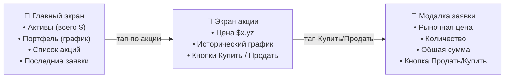
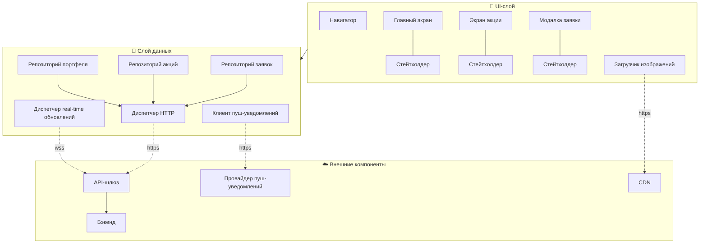
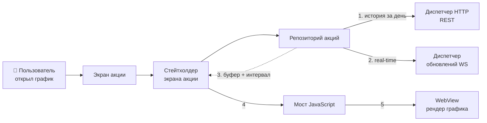

# Разбор: Трейдинговая платформа 📈

> Спроектировать мобильное приложение для торговли акциями — как E*TRADE, Robinhood, Trade Republic
> или eToro. Классическая задача мобильного систем-дизайна: много данных в реальном времени, деньги,
> строгие требования к безопасности и плавности UI.

Проходим по фреймворку [«ТАВДИ»](README.md#как-проходить-собес-фреймворк-из-5-шагов): Требования →
API → Высокоуровневая архитектура → Детали → Итоги.

Чем эта задача трудна и интересна:

- **Высокочастотные потоки данных.** Цены и заявки меняются несколько раз в секунду. Каждое
  обновление должно доходить с минимальной задержкой — иногда решают миллисекунды.
- **Реальные деньги.** Ошибка в округлении цены или потеря заявки недопустимы. Нужны точность и
  надёжность.
- **Безопасность и регуляторика.** Финансовые данные — под защитой, плюс соответствие финансовым
  регламентам.

---

## Шаг 1. Требования — что именно строим

На собесе это диалог с интервьюером. Твоя цель — не угадать, а **сузить задачу** до того, что
реально успеешь спроектировать. Задавай вопросы: какие функции? какой масштаб? что за рамками?

### Функциональные требования (что пользователь может делать)

- **Смотреть портфель** — свои акции, их количество и текущие цены.
- **Покупать и продавать** — размещать и отменять заявки (orders).
- **Смотреть графики** — исторические и внутридневные данные по акции.
- **Получать пуш-уведомления** об изменении цены — даже когда приложение в фоне.

### Нефункциональные требования (свойства системы)

- **Реальное время.** Рыночные данные обновляются с минимальной задержкой — решения принимаются по
  актуальной цене.
- **Производительность.** UI плавный даже под потоком стриминговых данных и при сложных графиках.
  Торговля — быстрая и надёжная.
- **Безопасность.** Финансовые данные под защитой; надёжная аутентификация; соответствие
  регламентам.

### За рамками (out of scope)

- Торговля опционами и фьючерсами — только акции.
- Регистрация пользователей — считаем, что юзер уже вошёл.

### Масштаб

- До **~500 000 активных пользователей в день** на нескольких биржах.
- Тысячи акций, цены которых нужно обновлять в реальном времени.
- Архитектура «с нуля» — нет унаследованных систем и легаси-кода.

> 🧠 **Как запомнить требования.** Функции = **4 глагола**: *смотреть* портфель, *торговать*
> (покупать/продавать), *смотреть* графики, *получать* уведомления. Свойства = **БПР**:
> **Б**езопасность, **П**роизводительность, **Р**еальное время.

### Черновой эскиз UI

Три главных экрана. Прикинуть их полезно — от экранов легче идти к данным и API.



---

## Шаг 2. Дизайн API — как ходят данные

### Выбор протокола: гибрид REST + WebSocket

Платформе нужны **два разных типа взаимодействия**, и под каждый — свой протокол:

| Тип взаимодействия | Пример | Протокол | Почему |
|--------------------|--------|----------|--------|
| **По инициативе клиента** | разместить заявку, запросить портфель, историю | **HTTP/REST** | Надёжный, масштабируемый, структурированный «запрос → ответ». Стандарт мобильной разработки. |
| **По инициативе сервера, в реальном времени** | обновление цены, статуса заявки | **WebSocket** | Постоянное двунаправленное соединение: сервер мгновенно пушит данные с минимальной задержкой. |

> 🧠 **Правило выбора протокола.** Спроси себя: *«кто инициирует общение?»* Клиент дёргает —
> **REST**. Сервер сам присылает поток — **WebSocket**. Так делают eToro и Trade Republic.

### Эндпоинты

**Акции и графики:**

```
GET /v1/stocks/{symbol}
    → детали акции: текущая, макс., мин. цена, % изменения

GET /v1/stocks/{symbol}/history?interval={interval}&period={period}
    → исторические данные для графика
    interval = 1m (минута) / 1d (день) ...
    period   = 1wk (неделя) / 3mo (три месяца) ...
```

**Портфель и заявки:**

```
GET    /v1/portfolio
    → текущий портфель: акции и их количество

GET    /v1/orders?status={status}&page={page}&limit={limit}
    → список заявок с фильтром по статусу и пагинацией

POST   /v1/orders
    → создать заявку на покупку/продажу

DELETE /v1/orders/{orderId}
    → отменить заявку
```

**Уведомления о цене:**

```
GET    /v1/notifications        → все оповещения
POST   /v1/notifications        → создать оповещение
DELETE /v1/notifications/{id}   → удалить оповещение
```

### Пагинация: offset-based (на основе смещений)

Для истории заявок берём **пагинацию по смещениям** (`page` + `limit`), а не cursor-based. Почему
это здесь ок:

- Заявки **редко меняются** после создания.
- Пользователь смотрит в основном **недавнюю активность** — глубоко не листает.

### Модели данных (Kotlin)

```kotlin
data class Stock(
    val id: String,
    val symbol: String,
    val name: String,
    val currentPrice: BigDecimal,
    val changePercent: BigDecimal,
    val highPrice: BigDecimal,
    // ...
)

data class Portfolio(
    val stocks: List<PortfolioStock>,
)

data class PortfolioStock(
    val stock: Stock,
    val quantity: BigDecimal,
    val averagePrice: BigDecimal,
)

data class Order(
    val id: String,
    val stockSymbol: String,
    val quantity: BigDecimal,
    val status: OrderStatus,
    val createdAt: String,
)

enum class OrderStatus { OPEN, EXECUTED, CANCELED }
```

> ⚠️ **ГЛАВНОЕ ПРАВИЛО ФИНАНСОВЫХ ПРИЛОЖЕНИЙ: деньги — это `BigDecimal`, не `Float`/`Double`.**
> Плавающая точка при округлении вносит погрешность, недопустимую для денег: например,
> `0.1 + 0.2 != 0.3`. `BigDecimal` (Kotlin) / `Decimal` (Swift) хранит десятичные дроби точно и
> считает без потерь. Потеря пары наносекунд на вычисление здесь важнее, чем потеря копейки. Это —
> **любимый вопрос на собесе**: покажи, что знаешь про `BigDecimal`.

### Соединение по WebSocket

Real-time данные идут через WebSocket-соединение (например, `wss://api.stocktrading.com/ws`) с
несколькими типами сообщений (каналами):

- **`stock-prices`** — текущая цена выбранных акций.
- **`order-updates`** — изменение статуса заявок.
- **`portfolio-updates`** — стоимость портфеля вслед за рынком.

Чтобы подписаться, клиент шлёт событие:

```json
{
  "action": "subscribe",
  "channels": [
    { "name": "stock-prices", "symbols": ["AAPL", "GOOGL", "MSFT"] }
  ]
}
```

> 🧠 **Ключевая идея шага 2.** Один протокол не покрывает всё. **REST** — «спросил и получил» для
> заявок, портфеля, истории. **WebSocket** — «подписался и слушаешь» для цен и статусов. Деньги
> везде — `BigDecimal`.

---

## Шаг 3. Высокоуровневая архитектура клиента

Строим приложение с **чёткой многослойной архитектурой** — так проще сопровождать и тестировать
код. UI отделён от данных, каждый экран работает под своим стейтхолдером.



### Внешние серверные компоненты

- **Бэкенд** — общается с клиентом по REST и WebSocket, отвечает за согласованность данных.
- **CDN** — ускоряет доступ к статике (исторические данные, графики, картинки), кэшируя ближе к
  пользователю.
- **Провайдер пуш-уведомлений** — оповещает о смене статуса заявок и цен, даже когда приложение в
  фоне. (На Android это **FCM — Firebase Cloud Messaging**.)
- **API-шлюз (gateway)** — посредник между клиентом и бэкендом; защищает бэкенд от перегрузок и
  злоумышленников.

### API-шлюз — почему ему уделяют столько внимания

На трейдинговых платформах безопасность критична. Шлюз проверяет и маршрутизирует все запросы,
блокирует подозрительные — до бэкенда доходит только «чистый» трафик. Пять функций шлюза:

| Функция | Что делает |
|---------|-----------|
| **Безопасность** | Аутентификация и авторизация, отсекает подозрительных клиентов. |
| **Управление трафиком** | Rate limiting, маршрутизация, защита от перегрузки в пиковые часы. |
| **Обработка запросов** | Проверяет и при необходимости преобразует запросы/ответы, следит за заголовками. |
| **Мониторинг** | Метрики производительности API, раннее обнаружение проблем. |
| **Упрощение** | Даёт клиенту единый чистый API, скрывая сложность бэкенда. |

> 🧠 **Мнемоника функций шлюза: «БУОМУ»** — **Б**езопасность, **У**правление трафиком, **О**бработка
> запросов, **М**ониторинг, **У**прощение. Проще: шлюз — это *охранник + регулировщик + ресепшн*
> перед бэкендом.

### UI-слой

Три экрана, каждый под своим **стейтхолдером** (на Android — `ViewModel` + `StateFlow`):

- **Главный экран** — ядро приложения: обзор портфеля и последние заявки (покупка/продажа).
- **Экран акции** — полная инфа по бумаге: цены, ключевые показатели, график.
- **Модалка заявки** — простой интерфейс покупки/продажи.

### Слой данных

Три репозитория (невидимые пользователю источники правды):

- **Репозиторий портфеля** — единый источник правды об активах; непрерывно синхронизируется в
  реальном времени.
- **Репозиторий акций** — рыночные данные; на экране всегда только актуальные цены.
- **Репозиторий заявок** — создаёт трейдинговые транзакции и отслеживает их статус.

Плюс **клиент пуш-уведомлений** — ждёт важные сообщения от бэкенда и вовремя оповещает юзера.

### Хранилище данных: два кэша под разные требования

Данные разной «критичности по времени» → разные хранилища. Это важное архитектурное решение:

| Тип данных | Пример | Кэш | Почему |
|------------|--------|-----|--------|
| **Критичные ко времени** | текущая цена акции | **В памяти** (in-memory), полностью в RAM | Нужны мгновенно и свежими. Диск — слишком медленно; согласованность важнее для денег. |
| **Менее критичные** | исторические графики, настройки | **На диске** (Room/DataStore) с политикой вытеснения | Баланс производительности и надёжности; переживает перезапуск. |

> 🧠 **Правило кэша.** Спроси: *«если данные протухнут на секунду — это катастрофа?»* Цена акции —
> да, держим в **RAM**. История за прошлый год — нет, держим на **диске**.

---

## Шаг 4. Детальная проработка: графики цен

Самая сложная и уникальная часть — **графики**. Разберём два вида: **исторический** (за день/неделю/
месяц/год) и **внутридневной** (intraday, обновляется в реальном времени несколько раз в секунду).

### 4.1. Плотность данных — фундамент проблемы

Каждый период = свои трудности:

- **Высокая плотность** (поминутный график) → много точек → тяжёлый рендеринг, большой расход
  памяти.
- **Низкая плотность** → можно «сгладить» важные движения цены → пользователь примет неверное
  решение.

> 📊 Пример: график за день с минутными точками — это ~390 точек (6,5 торговых часов). График за
> 5 лет по дню — уже >1250 точек. Чем больше точек, тем точнее график, но тем ниже
> производительность. Ищем баланс.

### 4.2. Как рендерить исторический график — 4 варианта

| Способ | Описание | Плюсы | Минусы |
|--------|----------|-------|--------|
| **Нативно** | Рисуем сами через графический API (Android Canvas / iOS Core Graphics) | Полный контроль, максимум производительности, аппаратное ускорение | Сложно и долго; нужен спец-навык; дублирование кода под платформы |
| **Сторонняя библиотека** | Готовые компоненты (MPAndroidChart, Charts) | Быстро; жесты и масштаб из коробки; есть документация | Медленнее нативного; проблемы при интеграции с нативными компонентами |
| **WebView** | Веб-инструменты (D3.js, Chart.js, TradingView) внутри WebView | Богатый функционал; **одинаково на всех платформах** | Ниже производительность; выше расход памяти; ощущается менее «нативно» |
| **Сервер (Image API)** | График рисуется на сервере, клиент получает картинку | Минимум работы на клиенте; одинаково везде | Почти не интерактивно; зависимость от сети; нагрузка на сервер |

**Выбор: WebView.** Бизнес-контекст — несколько разных клиентов работают с одним бэкендом. WebView
даёт мощные веб-библиотеки для финансовых графиков, и график выглядит **одинаково на всех
платформах**.

> 🏭 **Из индустрии.** eToro встроил TradingView как отдельный веб-компонент. Robinhood, наоборот,
> ради производительности на Android взял нативную библиотеку **Spark** (open-source спарклайны).
> Вывод: единственно верного ответа нет — выбор диктует бизнес-контекст.

### 4.3. Оптимизация WebView — 4 фронта работ

WebView мощный, но тяжёлый. Оптимизируем по четырём направлениям:

**1. Производительность.** Сложные JS-библиотеки (D3.js, ECharts) грузят устройство. Нужно:

- изолировать графики от высокоприоритетных потоков (чтобы UI не тормозил);
- **предобрабатывать данные на сервере**, снижая нагрузку на устройство;
- упрощать обновления, чтобы не перерисовывать график целиком;
- после первой загрузки обновлять только **дельту** (что изменилось).

**2. Плотность данных.**

- предобрабатывать историю до передачи в WebView (меньше работы для JS);
- **пошаговая загрузка** (progressive): сначала низкое разрешение, при необходимости — детальнее.

**3. Взаимодействие и отклик.** Жесты в WebView не такие плавные, как нативные:

- по возможности выполнять вычисления на бэкенде или в фоновых потоках;
- профилировать производительность на разных устройствах.

**4. Визуальная интеграция.** WebView не должен выглядеть «чужеродно»:

- привести стили графиков к дизайн-системе приложения;
- настроить параметры WebView;
- следовать UI-практикам платформы.

> 📱 **Android-специфика WebView.** WebView обновляется независимо от приложения (через Google
> Play / системные обновления), поэтому в разных версиях Android он ведёт себя по-разному — **нужно
> тестировать на разных версиях**. (На iOS аналог — `WKWebView` со своими нюансами памяти и
> производительности.)

### 4.4. Внутридневной график в реальном времени

Во время торгов цена меняется несколько раз в секунду. Как обновлять график — критично для расхода
батареи, памяти и плавности.

**3 стратегии обновления:**

| Стратегия | Как | Плюсы | Минусы |
|-----------|-----|-------|--------|
| **Прямое обновление UI** | Обновляем сразу при каждой точке из WebSocket | Просто; юзер видит самые свежие данные; минимальная задержка | При частых обновлениях жрёт батарею; перегрузка потока рендеринга и визуализации |
| **Обновление через буфер** | Копим точки в буфере, обновляем раз в фикс. интервал | Реже обновлений → экономия батареи; данные сглаживаются | Небольшая задержка; нужна аккуратная настройка частоты; между обновлениями точки могут теряться |
| **На основе приоритетов** | У каждого обновления свой приоритет; критичные — чаще | Ресурсы туда, где важнее; лучший UX | Сложная реализация; связанные обновления могут запаздывать |

**Выбор: обновление через буфер.** Для одного графика это лучший баланс между производительностью и
расходом ресурсов.

> 🧠 **Аналогия буфера.** Прямое обновление — это как отвечать на каждое сообщение в чате мгновенно
> (выматывает). Буфер — собрать сообщения за 2 секунды и ответить пачкой (эффективно, почти без
> потери актуальности).

### 4.5. Реализация буферизации: три новых компонента

Чтобы обновлять график через буфер, добавляем в архитектуру:

1. **Логика буферизации в репозитории акций** — точки цены из WebSocket копятся в буфере в порядке
   поступления.
2. **Планировщик обновлений** — срабатывает через фиксированный интервал (например, каждые
   1–2 секунды) и по сигналу отдаёт накопленный буфер в WebView.
3. **Мост JavaScript (JS Bridge)** — канал связи между нативным кодом и графиком в WebView.

**Почему нужен мост JavaScript.** График рисует JS внутри WebView, а значит, обработанные данные
надо туда передавать. Мост даёт чёткое разделение ответственности:

- **нативный код** — управляет WebSocket-соединением, проверяет и предобрабатывает данные,
  буферизует, задаёт время обновления;
- **WebView** — только рендерит график и обрабатывает жесты (зум, панорама).

Мост двунаправленный:

- **нативный → WebView**: обновлённые цены, смена конфигурации, пользовательские настройки;
- **WebView → нативный**: действия юзера (масштаб, переключение вида).

> 📱 **Android-реализация.** Мост — это `JavascriptInterface` (нативный код ↔ JS). Буферизацию и
> **троттлинг** удобно делать на **Kotlin Flow** вне главного потока: оператор `sample()` /
> `debounce()` + `flowOn(Dispatchers.Default)`. WebSocket — `OkHttp WebSocket`. (На iOS: аналог —
> `WKUserContentController` / `WKScriptMessageHandler` + операторы `throttle`/`debounce` из Combine.)

### 4.6. Поток данных при обновлении графика



Шаги:

1. **REST** отдаёт исторические данные за текущий день — основа графика.
2. **WebSocket** параллельно шлёт real-time обновления.
3. **Репозиторий** объединяет оба источника и буферизует: берёт историю как старт, копит
   WebSocket-обновления в буфере, через заданный интервал отдаёт накопленное подписчикам.
4. **Стейтхолдер** подписан на эти данные, получает их и передаёт в **мост JavaScript**.
5. **WebView** добавляет обновления на график — создаётся видимость плавной анимации в реальном
   времени.

### 4.7. Узкие места и оптимизации

Производительность real-time UI может просесть. Где искать и что делать:

| Узкое место | Проблема | Решение |
|-------------|----------|---------|
| **Работа WebView** | Частые обновления жрут ресурсы | Перерисовывать не весь график, а только затронутые места; отключать анимации в периоды частых обновлений |
| **Обработка данных** | Вычисления над рыночными данными тяжёлые | Перенести преобразования в нативный код и фоновые потоки; предвычислять производные значения; кэшировать вычисленное |
| **Мост JavaScript** | Каждое обращение к мосту стоит ресурсов | Накапливать обновления и слать пачкой за одно обращение; компактные форматы (меньше затрат на сериализацию); подобрать оптимальную частоту |
| **Нестабильное соединение** | Мобильные сети ненадёжны | Чётко показывать, что данные устарели; экспоненциальная задержка (backoff) перед переподключением |
| **Заряд батареи** | Частые обновления сажают батарею | Ставить real-time на паузу в фоне; **адаптивный троттлинг** в зависимости от уровня заряда |

### 4.8. Масштабирование (когда база вырастет)

- **Фильтрация WebSocket-сообщений на сервере** — клиент получает только нужные ему данные (меньше
  обработки на клиенте, особенно после появления новых функций).
- **Размер буфера** — достаточно большой, чтобы вмещать все точки даже при высокой волатильности; на
  практике для большинства акций хватает буфера на **10–20 значений цены**.
- **Адаптивный планировщик обновлений** — частота зависит от условий: рынок (в волатильные часы
  чаще), состояние устройства (заряд), вовлечённость (смотрит ли юзер на экран или свернул
  приложение). Можно дать пользователю настраивать частоту.

> 🏭 **Из индустрии.** J.P. Morgan и Commerzbank, а также Binomo используют нативный движок
> **SciChart** для дашбордов с real-time графиками. Биржа **Coinbase** отдаёт актуальные рыночные
> данные, заявки и сделки через **WebSocket**-канал.

---

## Шаг 5. Итоги

Мы спроектировали мобильную трейдинговую платформу: показ цен в реальном времени, размещение/отмена
заявок, пуш-уведомления об изменении цен, исторические графики.

**Ключевые решения, которые стоит помнить:**

- **Два протокола:** REST для действий по инициативе клиента + WebSocket для real-time стрима.
- **`BigDecimal` для денег** — точность важнее скорости.
- **Многослойная архитектура:** UI отделён от данных → проще тестировать и сопровождать.
- **Два кэша:** RAM для критичных ко времени цен, диск — для истории и настроек.
- **Графики через WebView** + **буферизация обновлений** через мост JavaScript — баланс
  функциональности и производительности.

**Темы для роста (назови их в конце собеса — покажешь широту):**

- **Оффлайн-режим** — при плохой сети кэшировать заявки и продолжать работу после переподключения.
- **Мультиплатформенность** — адаптировать архитектуру под планшеты, веб, десктоп.
- **Соответствие регламентам** — локальные стандарты биржевой деятельности в разных регионах.
- **Персонализация UI** — настраиваемые дашборды и списки.

---

## Вопросы для самопроверки ✅

Ответь, не подглядывая. Ответы — под спойлерами.

**1. Почему для трейдинговой платформы выбирают гибрид REST + WebSocket, а не что-то одно?**

<details><summary>Ответ</summary>

Разные типы взаимодействия. REST — для действий по инициативе клиента (разместить заявку, запросить
портфель/историю): надёжный «запрос → ответ». WebSocket — для данных, которые сервер шлёт сам в
реальном времени (цены, статусы заявок): постоянное двунаправленное соединение с минимальной
задержкой. Одним протоколом хорошо оба сценария не закрыть.
</details>

**2. Почему деньги хранят в `BigDecimal`, а не в `Double`?**

<details><summary>Ответ</summary>

Плавающая точка (`Float`/`Double`) при округлении даёт погрешность (`0.1 + 0.2 != 0.3`), недопустимую
для денег. `BigDecimal` хранит десятичные дроби точно и считает без потерь. В финансах точность и
целостность данных важнее пары наносекунд на вычисление.
</details>

**3. Какие данные держим в памяти, а какие на диске, и почему?**

<details><summary>Ответ</summary>

Критичные ко времени (текущие цены) — **в памяти (RAM)**: нужны мгновенно и свежими, диск слишком
медленный. Менее критичные (исторические графики, настройки) — **на диске** (Room/DataStore) с
политикой вытеснения: переживают перезапуск, баланс скорости и надёжности.
</details>

**4. Почему для графиков выбрали WebView? В каком случае выбор был бы другим?**

<details><summary>Ответ</summary>

WebView даёт мощные веб-библиотеки для финансовых графиков и одинаковый вид на всех платформах — это
ценно, когда несколько клиентов работают с одним бэкендом. Но если критична производительность на
конкретной платформе, выбирают нативный рендер (так Robinhood взял нативную библиотеку Spark на
Android). Единственно верного ответа нет — решает бизнес-контекст.
</details>

**5. Что делает обновление графика «через буфер» и почему его предпочли прямому обновлению UI?**

<details><summary>Ответ</summary>

Точки цены из WebSocket копятся в буфере, а график обновляется не на каждую точку, а раз в
фиксированный интервал (1–2 с) накопленной пачкой. Это экономит батарею и не перегружает поток
рендеринга (в отличие от прямого обновления на каждую точку), при этом данные почти не устаревают.
Лучший баланс производительности и ресурсов.
</details>

**6. Зачем нужен мост JavaScript и как между кодом и WebView делится ответственность?**

<details><summary>Ответ</summary>

График рисует JS внутри WebView, поэтому данные надо туда передавать — этим занимается мост
(`JavascriptInterface` на Android). Разделение: **нативный код** управляет WebSocket, проверяет и
предобрабатывает данные, буферизует, задаёт тайминг; **WebView** только рендерит и обрабатывает жесты.
Мост двунаправленный: нативный → WebView (новые цены, конфиг), WebView → нативный (действия юзера).
</details>

**7. Назови три узких места real-time графика и оптимизацию под каждое.**

<details><summary>Ответ</summary>

Любые три из: (1) **работа WebView** → перерисовывать только изменения, гасить анимации при частых
апдейтах; (2) **обработка данных** → вынести вычисления в нативный код/фоновые потоки, кэшировать;
(3) **мост JavaScript** → слать обновления пачкой за одно обращение; (4) **нестабильная сеть** →
показывать «данные устарели», экспоненциальный backoff; (5) **батарея** → пауза в фоне, адаптивный
троттлинг по заряду.
</details>

**8. Пять функций API-шлюза?**

<details><summary>Ответ</summary>

«БУОМУ»: **Б**езопасность (аутентификация/авторизация), **У**правление трафиком (rate limiting,
маршрутизация), **О**бработка запросов (проверка/преобразование), **М**ониторинг (метрики API),
**У**прощение (единый чистый API поверх сложного бэкенда).
</details>

---

## Что почитать (ссылки из книги)

1. eToro использует REST, WebSocket и FIX (Financial Information eXchange) —
   [пресс-релиз](https://www.etoro.com/news-and-analysis/crypto/etoros-professional-crypto-exchange-adds-institutional-grade-product-suite-launches-revolutionary-inverted-fee-model-press-release/).
2. Состояние приложения Trade Republic для Android в 2024 году (REST + WebSocket) —
   [engineering.traderepublic.com](https://engineering.traderepublic.com/state-of-android-at-tr-2024-edition-bc032620b83e).
3. Шлюз API — [API Gateway (Wikipedia)](https://en.wikipedia.org/wiki/API_management#gateway).
4. Графики в приложении Robinhood — [using-charts](https://robinhood.com/us/en/support/articles/using-charts/).
5. Графики в приложении E*TRADE —
   [power-etrade-charting-enhancements](https://us.etrade.com/knowledge/library/getting-started/power-etrade-charting-enhancements).
6. [MPAndroidChart](https://github.com/PhilJay/MPAndroidChart).
7. Библиотека Charts для iOS — [ChartsOrg/Charts](https://github.com/ChartsOrg/Charts).
8. [TradingView](https://www.tradingview.com/).
9. В eToro используется TradingView —
   [пресс-релиз](https://www.etoro.com/news-and-analysis/press-releases/etoro-announces-major-charting-upgrade-in-partnership-with-tradingview).
10. Библиотека Robinhood Spark для Android — [robinhood/spark](https://github.com/robinhood/spark).
11. [SciChart](https://www.scichart.com/).
12. Применение SciChart в индустрии —
    [ios-android-native-apps-vs-javascript](https://www.scichart.com/blog/ios-android-native-apps-vs-javascript).
13. Применение WebSocket для обновления данных в реальном времени в Coinbase —
    [websocket-overview](https://docs.cdp.coinbase.com/exchange/docs/websocket-overview).
