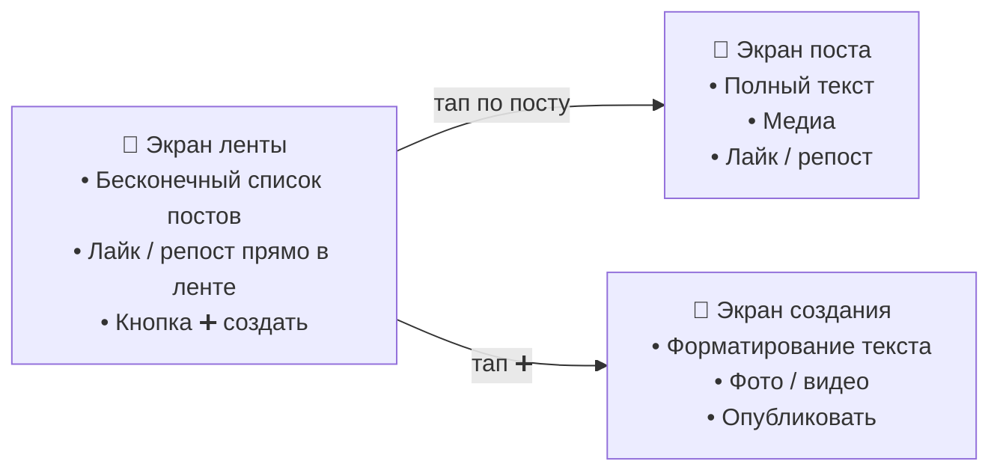
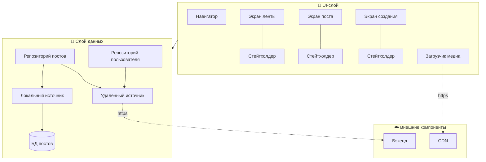
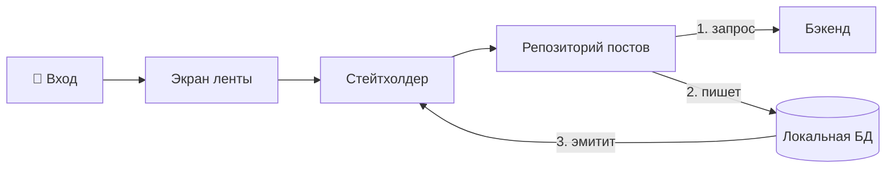

# Разбор: Лента новостей 📰

> Спроектировать мобильную ленту новостей — как Facebook News Feed, X (Twitter) Timeline или
> лента постов в Instagram. Классика мобильного систем-дизайна: бесконечный список контента,
> плавная прокрутка под медиа, офлайн и мгновенная реакция на лайки.

Проходим по тому же фреймворку [«ТАВДИ»](README.md#как-проходить-собес-фреймворк-из-5-шагов):
Требования → API → Высокоуровневая архитектура → Детали → Итоги.

Лента новостей — это **непрерывно обновляющийся список контента** (посты, фото, видео, ссылки).
Внешне ленты разные, а базовые функции у всех одни:

- прокручиваемый список постов;
- детальный просмотр отдельного поста;
- бесконечная прокрутка;
- социальные взаимодействия: лайки, репосты, комментарии.

> 🔁 **Держи в голове контраст с [трейдинговой платформой](01-trading-platform.md).** Там всё крутилось
> вокруг real-time, здесь — вокруг **плавной прокрутки и офлайна**. Поэтому многие решения
> **зеркальны**: там REST + WebSocket — здесь **только REST**; там offset-пагинация — здесь
> **курсорная**; там графики через WebView — здесь текст через **нативный UI**. Замечать эти развилки
> и объяснять *почему* — ровно то, что проверяют на собесе.

---

## Шаг 1. Требования — что именно строим

### Функциональные требования (что пользователь может делать)

- **Смотреть ленту** — прокручиваемый список постов от других пользователей.
- **Смотреть пост** — открыть полный текст по тапу; лайкать и репостить.
- **Создавать посты** — с форматированным текстом, изображениями и видео.
- **Бесконечная прокрутка** — новый контент подгружается по мере пролистывания.
- **Офлайн-просмотр** — ранее загруженный контент доступен без сети.

### Нефункциональные требования (свойства системы)

- **Масштабируемость** — до **500 млн активных пользователей в месяц**, без гео-ограничений.
- **Производительность** — плавная прокрутка даже при ленте, забитой медиа.
- **Надёжность** — работает при низкой скорости сети.
- **Эффективность трафика** — экономный, избирательный расход данных (умное кэширование).
- **Согласованность** — история действий копится в офлайне и синхронизируется при возврате сети.

### За рамками (out of scope)

- Обновление в реальном времени и пуш-уведомления.
- Предварительная загрузка постов *до* запуска приложения.
- Регистрация/аутентификация — считаем, что юзер уже вошёл.

> 🧠 **Как запомнить требования.** Функции = **4 глагола + 1 режим**: *смотреть* ленту, *смотреть*
> пост, *создавать* пост, *взаимодействовать* (лайк/репост) — и всё это **работает офлайн**. Свойства =
> **МПНЭС**: **М**асштаб, **П**роизводительность, **Н**адёжность, **Э**ффективность трафика,
> **С**огласованность.

### Черновой эскиз UI

Три главных экрана — от них легче идти к данным и API.



---

## Шаг 2. Дизайн API — как ходят данные

### Выбор протокола: чистый HTTP/REST

Все четыре взаимодействия происходят **по инициативе клиента** — клиент спрашивает, сервер отвечает:

| Взаимодействие | Что делает |
|----------------|-----------|
| **Получение новостей** | при открытии клиент запрашивает свежие посты |
| **Создание постов** | клиент отправляет новую публикацию на сервер |
| **Просмотр поста** | клиент запрашивает полные данные поста |
| **Действия пользователя** | клиент сообщает о лайке/репосте |

Раз нет данных, которые сервер шлёт *сам*, WebSocket не нужен. С учётом масштаба и нескольких типов
клиентов оптимум — **HTTP/REST**: надёжный, масштабируемый, привычный «запрос → ответ».

> 🧠 **Правило выбора протокола (то же, что в трейдинге).** Спроси: *«кто инициирует общение?»* Здесь
> **всегда клиент** → чистый REST. Real-time вынесли за рамки — иначе добавили бы WebSocket для живых
> счётчиков лайков.

**Формат данных: JSON** (против XML и Protocol Buffers). JSON человекочитаем, дёшев в разработке,
знаком всем и отлично ложится на REST. Protocol Buffers быстрее и компактнее, но им владеют не все —
берём его, только если команда в нём сильна.

### Эндпоинты

```
GET  /v1/feed?after=<cursor>&limit=30     → лента, тип FeedApiResponse
POST /v1/posts                            → создать пост (NewPostRequest) → 201 Created
GET  /v1/posts/{postId}                   → полный пост (PostDetailApiResponse)
POST /v1/posts/{postId}/interactions      → лайк/репост (PostInteractionRequest) → 201
```

Каждый запрос идёт с заголовками `Authentication: Bearer <токен>` и `Accept: application/json`.
Версия `/v1/` в пути — чтобы менять API без поломки старых клиентов.

### Пагинация: cursor-based (курсорная)

Для бесконечной ленты берём **курсор**, а не смещения (offset). Почему:

- лента **постоянно обновляется** → при offset появляются **дубликаты и пропуски**, а запросы
  замедляются по мере прокрутки;
- курсор — это **id из индексированного столбца** (быстрее, чем расчёт смещения);
- id постов уникальны → годятся для автоматической сортировки; курсор идеален для «живого» контента.

> 🔁 **Развилка с трейдингом.** История заявок там **редко меняется** и её мало листают → хватило
> offset. Лента **живая и бесконечная** → нужен курсор. Один и тот же вопрос, разные ответы —
> **решает характер данных**.

### Модели данных: два уровня (Kotlin)

```kotlin
// Лёгкая модель для СПИСКА — минимум данных, быстрый парсинг, меньше трафика
data class PostPreview(
    val postId: Long,
    val contentSummary: String,
    val author: AuthorPreview,
    val createdAt: String,
    val liked: Boolean,
    val likeCount: Int,
    val shareCount: Int,
    val attachmentPreviewImageUrl: String?,  // только URL превью, не сам файл
)

// Полная модель для ЭКРАНА ПОСТА — весь текст и все вложения в высоком разрешении
data class PostDetail(
    val postId: Long,
    val content: String,
    val author: AuthorPreview,
    val createdAt: String,
    val liked: Boolean,
    val likeCount: Int,
    val shareCount: Int,
    val attachments: List<Attachment>,
)
```

> 🧠 **Ключевая идея шага 2: две модели под две задачи.** `PostPreview` — «визитка» для ленты
> (грузится быстро, экономит трафик). `PostDetail` — «досье» для экрана поста (всё и в полном
> разрешении). На слабых устройствах и мобильной сети это экономит и память, и мегабайты.

### Кто генерирует id и время — клиент или сервер?

- **`requestId` (UUID)** генерирует **клиент** — для идемпотентности: повторная отправка не создаст
  дубль поста.
- **`postId` и `createdAt`** генерирует **сервер** — критичные значения должны быть согласованными,
  надёжными и уникальными (часы на телефоне врут, id не должны конфликтовать между устройствами).

> 🏭 **Из индустрии.** Для уникальных id при огромном потоке событий X (Twitter) использует систему
> **Snowflake ID**.

---

## Шаг 3. Высокоуровневая архитектура клиента

Строим **многослойную архитектуру**: UI отделён от данных, каждый экран под своим стейтхолдером,
компоненты связаны через **внедрение зависимостей (DI)**.



### Внешние серверные компоненты

- **Бэкенд** — RESTful-сервис на JSON; хранит всю бизнес-логику: создание постов, формирование ленты,
  обработку действий.
- **CDN (сеть доставки контента)** — раздаёт статику (изображения, видео из постов) с ближайшего к
  юзеру узла: быстрее загрузка, меньше нагрузка на бэкенд, важно в пиковые часы.

### UI-слой

Три экрана, каждый под своим **стейтхолдером** (на Android — `ViewModel` + `StateFlow`), плюс
**компонент-навигатор** для переходов и **загрузчик медиа**.

```kotlin
data class NewsFeedUIState(
    val feed: List<PostPreviewUIModel>,  // отдельная UI-модель, не модель данных!
    val isLoading: Boolean,
    val errorMessage: String?,
)
```

> 🧠 **UI-модель ≠ модель данных.** На слое данных — `PostPreview` (полный набор полей). На UI —
> `PostPreviewUIModel` (только то, что видно на экране). Разделение экономит память и держит UI ближе к
> его реальным потребностям.

### Оптимистичное обновление (optimistic writes)

Юзер жмёт лайк — стейтхолдер **сразу** обновляет UI, не дожидаясь ответа бэкенда. Реакция мгновенная,
синхронизация идёт в фоне. (Подробно — в шаге 4.)

### Слой данных и SSOT

- **Репозиторий постов** — центральный компонент: отдаёт ленту и посты, содержит бизнес-логику.
- **Репозиторий пользователя** — данные текущего юзера и токен авторизации.
- **Источники данных** — локальный (офлайн-хранилище, БД) и удалённый (сеть, бэкенд).

Главный принцип — **единственный источник достоверных данных (SSOT)**: локальная БД. При входе
репозиторий обновляет **локальную БД** из бэкенда, а UI подписан на **локальный** источник и получает
данные оттуда.



> 🧠 **Правило SSOT.** UI **никогда не читает из сети напрямую** — только из локальной БД. Сеть лишь
> *пополняет* БД, а БД *уведомляет* UI. Отсюда бесплатно получается офлайн: нет сети — читаем из БД.

---

## Шаг 4. Детальная проработка

Три самых интересных места: **офлайн-хранилище**, **оптимистичные обновления**, **плавная прокрутка**.

### 4.1. Локальное хранилище и офлайн-режим

**Выбор хранилища: реляционная БД** (против нереляционной и key-value).

| Хранилище | Плюсы | Минусы |
|-----------|-------|--------|
| **Реляционная БД** | Сложные запросы, фильтрация, сортировка; транзакции; целостность; зрелые инструменты | Сложнее при масштабировании |
| Нереляционная | Быстрая запись, гибкая схема | Слабее по целостности |
| Key-value | Максимально быстрый доступ | Не тянет сложную структуру |

**Выбор — реляционная БД** (Room на Android): ленте нужны сложные запросы и целостность, а инструменты
давно зрелые.

**Политика вытеснения — гибрид трёх стратегий** (нельзя хранить всё — 500 млн юзеров):

| Стратегия | Что делает |
|-----------|-----------|
| **LRU** (давность) | удаляет давно не открывавшиеся посты |
| **TTL** (время жизни) | у поста есть срок годности в кэше |
| **Минимальный порог** | всегда держим базовый минимум для офлайна |

Ориентиры: **100–200 Мбайт**, TTL **~15 дней**, порог **~50 постов** (2–3 экрана ленты).

> 🔁 **Развилка с трейдингом.** Там было **два кэша** (RAM для цен + диск для истории), потому что
> цена акции критична к времени. Здесь всё на **диске в одной реляционной БД** — посты не «протухают»
> за секунду, зато нужен офлайн.

### 4.2. Оптимистичные обновления и офлайн-действия

**Оптимистичное обновление** — обновляем UI *до* подтверждения бэкендом, будто ответ уже пришёл:

1. Юзер жмёт лайк → стейтхолдер **сразу** меняет UI.
2. Действие пишется в **локальную БД как очередь** и синхронизируется в фоне.
3. Успех → чистим запись. Провал → повторяем.

Чтобы копить действия в офлайне, заводим модель-**очередь**:

```kotlin
data class UserInteraction(
    val id: Long,
    val postId: Long,
    val userId: Long,
    val action: UserInteractionAction,   // LIKED, UNLIKED, SHARED, BOOKMARKED
    val status: UserInteractionStatus,   // PENDING, FAILED, CANCELED
    val createdAt: String,
    val updatedAt: String,
    val failureCount: Int,
)
```

Конфликты (пока был офлайн, на сервере изменилось) разрешаем стратегией **LWW — «побеждает последняя
запись»** (last write wins).

На слое данных для очереди добавляем **DAO** (объекты доступа к данным): `DAO для действий
пользователя` и `DAO для постов`.

**Обработка ошибок — повторы с экспоненциальной задержкой (backoff):**

1. Запрос не прошёл → статус `FAILED`.
2. Через растущий интервал — новая попытка.
3. Повторы до максимума. Дальше — по важности действия:
   - **некритичное** (лайк) → `CANCELED` + откат UI;
   - **критичное** (новый пост) → оповестить юзера пуш-уведомлением.

> 🧠 **Аналогия очереди.** Оптимистичное обновление — как отправить письмо и сразу пометить «доставлено»:
> обычно так и есть, а если почта вернёт ошибку — тихо повторишь или откатишь. Юзер не ждёт сервер.

> 🏭 **Из индустрии.** Instagram использует **Direct Mutation Manager** для согласованности данных при
> оптимистичных обновлениях и проблемах с сетью.

### 4.3. Форматированный текст: разметка, рендеринг, плавность

**Язык разметки: HTML** (против своего языка и Markdown).

| Язык | Плюсы | Минусы |
|------|-------|--------|
| Свой язык | Полный контроль | Дорого разрабатывать и сопровождать |
| **HTML** | Универсален, знаком, богатое форматирование | Сложнее; нужна очистка от **XSS** |
| Markdown | Прост | Возможностей может не хватить |

**Выбор — HTML**: универсален и всем знаком. Обязательное условие — бэкенд **очищает и валидирует**
HTML (защита от XSS-атак): OWASP Java HTML Sanitizer на Android.

**Рендеринг HTML: нативные компоненты UI** (против WebView).

| Способ | Плюсы | Минусы |
|--------|-------|--------|
| WebView | Рендер с минимумом усилий, одинаково везде | Тяжёлый, «не нативный», проблемы с анимацией ленты |
| **Нативный UI** | Плавная прокрутка, нативный вид, интеграция с элементами | Нужен свой HTML-парсер |

**Выбор — нативные компоненты UI.** Ленту прокручивают постоянно → плавность важнее экономии усилий.

> 🔁 **Главная развилка с трейдингом.** График там → **WebView** (нужны мощные веб-библиотеки, один вид
> на всех платформах). Текст ленты здесь → **нативный UI** (нужна плавность бесконечной прокрутки).
> Один вопрос «WebView или нативно?» — противоположные ответы. **Решает контекст:** редкий сложный
> график vs постоянно прокручиваемый простой контент.

Архитектуру UI дополняем четырьмя компонентами: **рендерер контента** + **HTML-парсер** (для показа) и
**редактор постов** + **HTML-энкодер** (для создания).

**Неплавная прокрутка — причины и лечение** (любимый вопрос на собесе):

| Узкое место | Решение |
|-------------|---------|
| **Неэффективный рендеринг** | **переиспользование представлений**: `RecyclerView` / `LazyColumn`/`LazyRow` (Compose) |
| **Синхронная загрузка медиа** | грузить изображения **асинхронно и параллельно** |
| **Блокировка основного потока** | тяжёлые операции — в **фоновые потоки** |
| **Сложные компоненты** | упрощать **вложенность** вью |
| **Плохое управление состоянием** | **буферизация** обновлений |
| **Неоптимизированные изображения** | предоптимизация + мощная **библиотека загрузки медиа** |

> 📱 **Android-специфика.** Переиспользование — это `RecyclerView` (View) или `LazyColumn`/`LazyRow`
> (Compose); на iOS — `UITableView`/`UICollectionView`. На экране живёт лишь горстка вью, а не тысячи.

**Динамический подбор качества медиа** — под мощность устройства и скорость сети:

- **изображения:** низкое `480×320`, среднее `720×480`, высокое `1080×720`;
- **видео:** низкое `360p`, среднее `720p`, высокое `1080p`.

Слабое устройство / медленная сеть → грузим версию пониже. Бэкенд хранит предобработанные варианты или
генерирует их на лету.

> 🏭 **Из индустрии.** Facebook на Android ускорил прокрутку фреймворком **Litho** (+42% к скорости).
> Pinterest применил **адаптивный битрейт видео** (ABR), Reddit — **отложенную загрузку** ненужных задач.

---

## Шаг 5. Итоги

Мы спроектировали ленту новостей: бесконечная прокрутка, создание постов с форматированием и медиа,
лайки/репосты, офлайн-режим.

**Ключевые решения, которые стоит помнить:**

- **Чистый REST + JSON** — всё по инициативе клиента, real-time за рамками.
- **Курсорная пагинация** — лента «живая», offset дал бы дубли.
- **Две модели:** `PostPreview` для списка, `PostDetail` для экрана поста.
- **SSOT:** локальная реляционная БД — единственный источник правды → бесплатный офлайн.
- **Политика вытеснения:** гибрид LRU + TTL + минимальный порог.
- **Оптимистичные обновления** + очередь действий + разрешение конфликтов через **LWW**.
- **HTML + нативный рендеринг** (не WebView) — ради плавной прокрутки.
- **Плавность:** переиспользование вью, async-загрузка медиа, фоновые потоки, динамическое качество.

**Темы для роста (назови в конце — покажешь широту):**

- **Комментарии** — отвечать на посты других.
- **Реальное время + пуш** — живые счётчики лайков, уведомления о новых постах.
- **Полнотекстовый поиск** (FTS) — искать посты офлайн и онлайн.
- **Редактирование и отложенные публикации** — менять и планировать посты.
- **Предзагрузка и многоязычность** — грузить заранее, поддержать разные языки.

---

## Вопросы для самопроверки ✅

Ответь, не подглядывая. Ответы — под спойлерами.

**1. Почему для ленты хватает чистого REST, а трейдингу нужен REST + WebSocket?**

<details><summary>Ответ</summary>

В ленте все взаимодействия — по инициативе клиента (получить ленту, создать пост, лайкнуть): клиент
спрашивает, сервер отвечает — это REST. Данных, которые сервер шлёт *сам* в реальном времени, нет
(обновления и пуши вынесли за рамки). У трейдинга же цены и статусы летят от сервера постоянно — под
это нужен WebSocket. Правило то же: *«кто инициирует общение?»*
</details>

**2. Почему для ленты выбрали курсорную пагинацию, а не offset?**

<details><summary>Ответ</summary>

Лента постоянно обновляется: при offset-пагинации новые посты сдвигают список → дубликаты и пропуски,
плюс запросы замедляются по мере прокрутки. Курсор — это id из индексированного столбца: быстрее
смещения, id уникальны и годятся для сортировки, идеально для «живого» бесконечного контента. (Для
истории заявок в трейдинге offset ок — она редко меняется и её мало листают.)
</details>

**3. Зачем две модели поста — `PostPreview` и `PostDetail`?**

<details><summary>Ответ</summary>

`PostPreview` — лёгкая модель для списка: минимум полей, только URL превью вместо самих файлов →
быстрый парсинг и экономия трафика при загрузке всей ленты. `PostDetail` — полная модель для экрана
поста: весь текст и вложения в высоком разрешении. Разделение экономит память и трафик на слабых
устройствах и мобильной сети.
</details>

**4. Что такое SSOT и как из него получается офлайн?**

<details><summary>Ответ</summary>

SSOT (single source of truth) — единственный источник достоверных данных, у нас это **локальная БД**.
UI никогда не читает из сети напрямую — только из БД. Сеть лишь *пополняет* БД, а БД *уведомляет* UI
о новом состоянии. Поэтому офлайн получается бесплатно: нет сети — просто читаем последнее состояние
из локальной БД.
</details>

**5. Что делает оптимистичное обновление и как обрабатываются ошибки?**

<details><summary>Ответ</summary>

При лайке UI обновляется **сразу**, не дожидаясь бэкенда, — реакция мгновенная. Действие пишется в
локальную очередь (`UserInteraction` со статусом `PENDING`) и синхронизируется в фоне. Если запрос не
прошёл — статус `FAILED` и повторы с экспоненциальной задержкой. После лимита: некритичное действие
(лайк) → `CANCELED` + откат UI; критичное (новый пост) → пуш-уведомление юзеру. Конфликты решаются
через LWW («побеждает последняя запись»).
</details>

**6. Почему текст ленты рендерят нативным UI, а график в трейдинге — через WebView?**

<details><summary>Ответ</summary>

Ленту прокручивают постоянно, поэтому критична **плавность** — нативные компоненты
(`RecyclerView`/`LazyColumn`) дают гладкую прокрутку и нативный вид, ценой своего HTML-парсера.
График — редкий сложный элемент, где важны мощные библиотеки и одинаковый вид на всех платформах, —
там выигрывает WebView. Один вопрос «WebView или нативно?», разные ответы — решает контекст.
</details>

**7. Назови три причины неплавной прокрутки и лечение к каждой.**

<details><summary>Ответ</summary>

Любые три из: (1) **неэффективный рендеринг** → переиспользование вью (RecyclerView/LazyColumn);
(2) **синхронная загрузка медиа** → грузить изображения асинхронно и параллельно; (3) **блокировка
основного потока** → тяжёлые операции в фон; (4) **сложные компоненты** → упростить вложенность;
(5) **неоптимизированные изображения** → предоптимизация + библиотека загрузки; (6) плюс динамический
подбор качества медиа под устройство и сеть.
</details>

**8. Какое хранилище выбрали для офлайна и какая у него политика вытеснения?**

<details><summary>Ответ</summary>

**Реляционная БД** (Room): нужны сложные запросы, сортировка/фильтрация, транзакции и целостность, а
инструменты зрелые. Хранить всё нельзя (500 млн юзеров), поэтому политика вытеснения — **гибрид**: LRU
(давность использования) + TTL (время жизни в кэше) + минимальный порог (базовый минимум для офлайна).
Ориентиры: 100–200 Мбайт, TTL ~15 дней, ~50 постов.
</details>

---

## Что почитать (ссылки из книги)

- Graph API (Meta) — [graph-api](https://developers.facebook.com/docs/graph-api),
  RESTful API Reddit — [dev/api](https://www.reddit.com/dev/api),
  API X (Twitter) — [getting-started](https://developer.x.com/en/docs/twitter-api/getting-started/about-twitter-api).
- [Snowflake ID](https://en.wikipedia.org/wiki/Snowflake_ID) — уникальные id при огромном потоке.
- Оптимистичные обновления в Instagram —
  [Direct Mutation Manager](https://instagram-engineering.com/making-direct-messages-reliable-and-fast-a152bdfd697f).
- Текстовая библиотека X — [twitter-text](https://github.com/twitter/twitter-text),
  разметка Reddit — [markdown](https://www.reddit.com/wiki/markdown/).
- Плавная прокрутка: Facebook [Litho](https://engineering.fb.com/2018/01/31/android/improving-android-video-on-news-feed-with-litho),
  Pinterest [ABR-видео](https://medium.com/pinterest-engineering/improving-abr-video-performance-at-pinterest-f0ea47a6d4fc),
  Reddit [server-driven feed UI](https://www.infoq.com/news/2023/09/reddit-feed-server-driven-ui).
- [Полнотекстовый поиск (FTS)](https://ru.wikipedia.org/wiki/Полнотекстовый_поиск),
  [предзагрузка (prefetching)](https://en.wikipedia.org/wiki/Prefetching).
</content>
</invoke>
