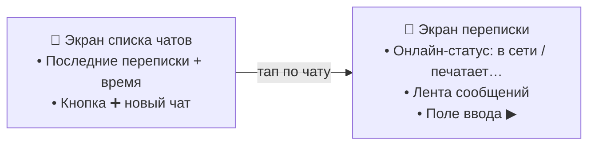
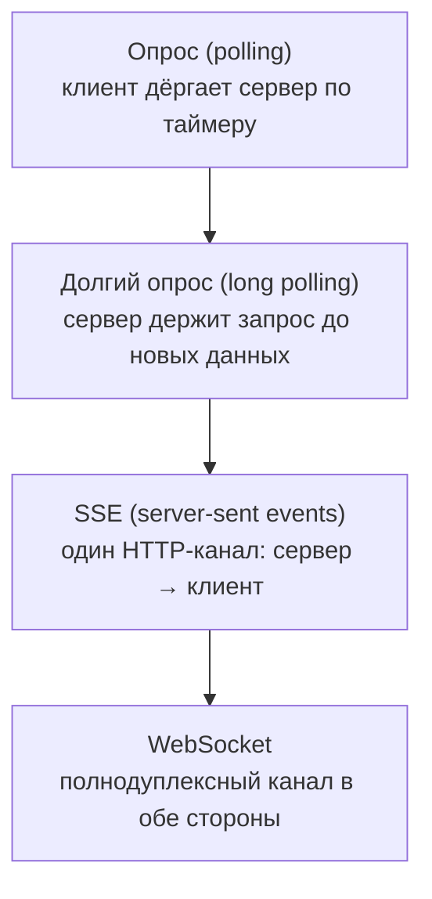
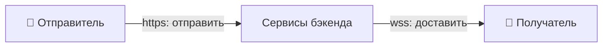
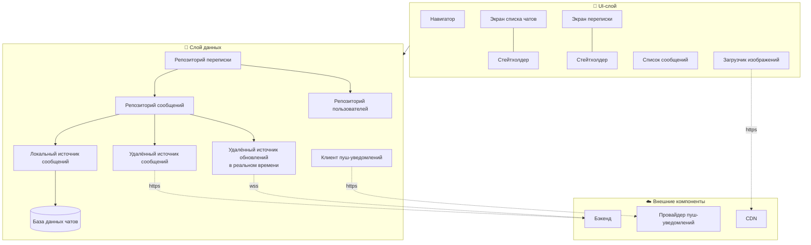
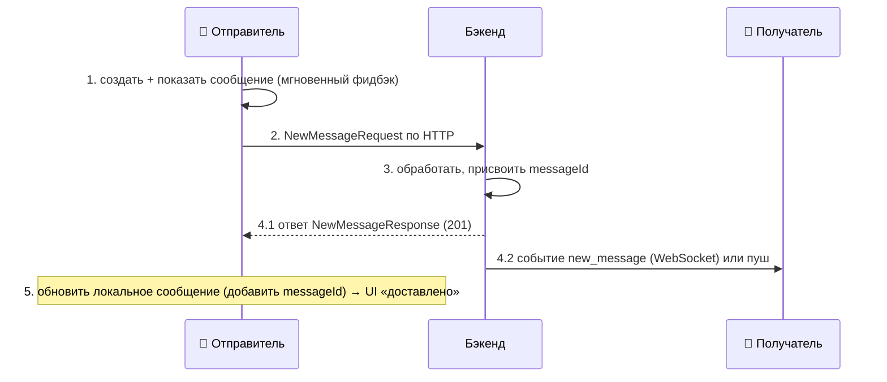
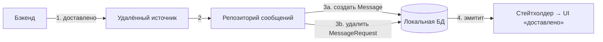
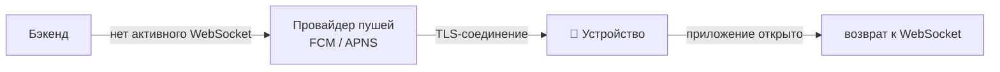

# Разбор: Мессенджер 💬

> Спроектировать мобильный мессенджер — как WhatsApp, Facebook Messenger, Telegram или Discord.
> Классика систем-дизайна про **реальное время**: сообщения должны долетать до собеседника мгновенно,
> в правильном порядке и не теряться, даже когда сеть отваливается.

Проходим по тому же фреймворку [«ТАВДИ»](README.md#как-проходить-собес-фреймворк-из-5-шагов):
Требования → API → Высокоуровневая архитектура → Детали → Итоги.

Мессенджер — это приложение для **обмена сообщениями в реальном времени** между людьми. Внешне
мессенджеры разные, но базовые функции у всех одни:

- список последних чатов;
- переписка внутри чата;
- отправка и получение сообщений в реальном времени;
- онлайн-статусы: «в сети», «печатает…», галочки прочтения.

> 🧠 **Два кита, вокруг которых всё крутится:** **реальное время** (сообщение и статусы летят в обе
> стороны мгновенно — этого не даёт обычный «запрос → ответ») и **надёжная доставка** (сообщение нельзя
> потерять и нельзя перепутать порядок, даже в офлайне). Почти каждое решение ниже служит одному из
> них — держи эту пару в голове, и логика главы соберётся сама.

---

## Шаг 1. Требования — что именно строим

### Функциональные требования (что пользователь может делать)

- **Смотреть список чатов** — последние переписки, кнопка ➕ начать новый чат.
- **Переписываться** — отправлять и получать **текстовые** сообщения в реальном времени.
- **Видеть онлайн-статус собеседника** — «в сети», «печатает…».
- **Видеть статус своих сообщений** — доставлено / прочитано.
- **Синхронизация при старте** — при заходе клиент подгружает пропущенные сообщения.
- **Пуш-уведомления** — о новых сообщениях, когда приложение закрыто.

### Нефункциональные требования (свойства системы)

- **Масштабируемость** — до **30 млн активных пользователей в день (DAU)**, без гео-ограничений.
- **Целостность данных** — ни одно сообщение не теряется и не задваивается; порядок сохраняется.
- **Надёжность** — клиент работает стабильно даже при плохой сети (это единственный интерфейс к чату).

### За рамками (out of scope)

- Регистрация и аутентификация — считаем, что юзер уже вошёл.
- **Групповые** чаты — только личная переписка (один на один).
- Медиафайлы (фото, видео, голосовые).
- Сквозное шифрование.

> 🧠 **Как запомнить требования.** Функции = **список чатов → переписка (real-time) → статусы → синк →
> пуши**. Свойства = **МЦН**: **М**асштаб (30 млн DAU), **Ц**елостность (не потерять, не перепутать),
> **Н**адёжность (живёт на плохой сети). А главное упрощение — **только личные текстовые чаты**: группы,
> медиа и шифрование намеренно за рамками, чтобы уложиться во время.

> 🏭 **Из индустрии.** На вопрос о числе пользователей уточни: **DAU** (активные в день) важнее общего
> числа зарегистрированных — именно от него зависит нагрузка. Разговор про масштаб и то, как он влияет
> на архитектуру, — сам по себе плюс на собесе.

### Черновой эскиз UI

Два главных экрана — от них легче идти к данным и API.



---

## Шаг 2. Дизайн API — как ходят данные

Клиенты общаются не напрямую, а **через бэкенд-посредник**: он получает, направляет и хранит сообщение,
пока получатель офлайн. Здесь два типа взаимодействий:

| Тип | Кто инициирует | Что делает |
|-----|----------------|-----------|
| **Отправка / синхронизация** | клиент | отправить сообщение, подтянуть пропущенные |
| **Доставка / статусы** | **бэкенд** | доставить входящее, обновить онлайн-статус и галочки |

Первый тип отлично ложится на HTTP. А вот второй — проблема: HTTP не умеет, чтобы **сервер сам** будил
клиента. Нужен способ доставлять данные по инициативе сервера, быстро и надёжно.

### Как сервер шлёт данные сам: 4 подхода



| Способ | Как работает | Плюсы | Минусы |
|--------|--------------|-------|--------|
| **Опрос** | клиент периодически спрашивает «есть новое?» | простой, обычный HTTP, работает везде | куча пустых ответов → трата сети и ресурсов |
| **Долгий опрос** | сервер не закрывает запрос, пока не появятся данные или тайм-аут | меньше пустых запросов | всё ещё неэффективен при редких сообщениях; при нескольких серверах ответ может прийти не на тот; сложно понять, что клиент отвалился |
| **SSE** | один постоянный HTTP-канал, сервер шлёт события сам | одно соединение, работает поверх HTTP/2, экономит трафик | **однонаправленный** — обратный канал нужен отдельным HTTP; дорого при множестве соединений |
| **WebSocket** | HTTP-соединение через `Upgrade` превращается в полнодуплексный канал (порты 80/443, дружит с фаерволами) | **двусторонний**, низкая задержка, нет циклов «запрос → ответ» | сложнее реализация и инфраструктура; тяжело масштабировать постоянные соединения |

> 🧠 **Лестница из четырёх ступеней.** Опрос → долгий опрос → SSE → WebSocket — каждая следующая
> эффективнее предыдущей для real-time. Опрос «дёргает» сервер вслепую, долгий опрос «ждёт на линии»,
> SSE — **труба в одну сторону**, WebSocket — **труба в обе**. Для чата, где болтают обе стороны,
> побеждает последняя.

> 🏭 **Из индустрии.** Живых протоколов много: **WebSocket** (Slack, Uber), **XMPP** (изначально
> WhatsApp, Kik), **MQTT** (изначально Facebook Messenger), **WebRTC** (голос/видео в Discord),
> **IRC** (групповые чаты Mozilla).

### Выбор протокола: гибрид HTTP + WebSocket

- **HTTP/REST** — для операций по инициативе клиента (отправка сообщений).
- **WebSocket** — для функций реального времени, которые сервер шлёт сам (входящие, статусы).

**Почему WebSocket, а не SSE?** SSE — только в одну сторону, обратный канал пришлось бы вести отдельным
HTTP. WebSocket двусторонний и с меньшей задержкой — а в чате важна каждая миллисекунда, например чтобы
мгновенно показать «прочитано» или «печатает…».

> 🧠 **Правило выбора протокола.** Спроси: *«кто инициирует и сколько сторон говорит?»* Клиент
> спрашивает → **REST**. Сервер шлёт сам, но в одну сторону (лента событий) → **SSE**. Обе стороны
> болтают в реальном времени (чат) → **WebSocket**. Одновременно тащить оба протокола сложнее, поэтому
> WebSocket применяем **только** к real-time, чтобы не усложнять масштабирование.



### Эндпоинты (client-initiated, поверх HTTP)

```
POST /v1/messages                                          → отправить (NewMessageRequest) → 201 Created
GET  /v1/messages?lastSyncedMessage=<id>&limit=<limit>     → синхронизация при старте (SyncMessagesResponse) → 200 OK
```

Каждый запрос идёт с заголовком `Authentication: Bearer <токен>`. Версия `/v1/` в пути — чтобы менять
API без поломки старых клиентов.

### Модели данных

```kotlin
// Запрос на отправку и ответ сервера
data class NewMessageRequest(
    val requestId: Long,     // идемпотентный ключ — бэкенд отсеивает дубли повторных отправок
    val toUserId: Long,
    val content: String,
    val createdAt: String,
)
data class NewMessageResponse(
    val message: Message,
    val fromMessageRequestId: Long?,  // помогает клиенту сопоставить ответ с отправленным запросом
)

// Главная модель системы
data class Message(
    val messageId: Long,
    val fromUserId: Long,
    val toUserId: Long,
    val content: String,
    val status: MessageStatus,
    val createdAt: String,
)
enum class MessageStatus { PENDING, SYNCED, DELIVERED, READ }
```

Поле `status` определяет индикатор на экране: **PENDING** — ещё не получено бэкендом, **SYNCED** —
бэкенд получил, **DELIVERED** — доставлено получателю, **READ** — прочитано.

```kotlin
// Лёгкая модель для СПИСКА чатов — только то, что видно в списке
data class ConversationPreview(
    val contact: User,
    val lastMessageSummary: String,
    val lastMessageTimestamp: String,
    val unreadCount: Int,
)
data class User(val id: Long, val name: String, val avatarUrl: String, val lastConnectedAt: String)

// Полная модель для ЭКРАНА чата
data class Conversation(
    val contact: User,
    val contactInfo: ContactInfo?,
    val unreadCount: Int,
    val messages: List<Message>,
)
data class ContactInfo(val onlineStatus: String, val typing: Boolean)
```

> 🧠 **Две модели под две задачи** (как и в [ленте новостей](02-news-feed.md#модели-данных-два-уровня-kotlin)):
> `ConversationPreview` — «визитка» для списка чатов (грузится быстро). `Conversation` — «досье» для
> экрана переписки (весь диалог + статус собеседника). Каждый чат один на один, поэтому `UserId`
> собеседника = идентификатор чата.

> 🧠 **Кто генерирует id и время.** `requestId` — **клиент** (идемпотентность: повторная отправка не
> создаст дубль). `messageId` и `createdAt` в `Message` — **сервер** (единый источник правды, часы на
> телефоне врут). Это тот же принцип, что и `Snowflake ID` в других разборах.

### Функции реального времени (поверх WebSocket)

Постоянное соединение открывается на `wss://my-api.chat.com/v1/socket/updates`. Формат каждого события —
JSON из двух полей: `type` (тип события) и `payload` (данные под этот тип):

```json
{ "type": "new_message", "payload": { } }
```

- `new_message` — новое входящее сообщение;
- `message_read` — сообщение прочитано получателем;
- `contact_status_update` — статус контакта изменился (в сети / печатает…).

> 📝 **Зачем `/v1/` даже у WebSocket-URI.** Версия в адресе позволяет менять протокол обновлений, не
> ломая старых клиентов, — со временем можно вводить `/v2/` и вести обе версии параллельно.

---

## Шаг 3. Высокоуровневая архитектура клиента

Строим **многослойную архитектуру** с однонаправленным потоком данных (UDF): UI отделён от данных,
каждый экран под своим стейтхолдером, всё связано через **внедрение зависимостей (DI)**.



### Внешние серверные компоненты

- **Бэкенд** — принимает сообщения по HTTP, доставляет входящие и статусы по WebSocket, хранит переписку.
- **CDN** — раздаёт аватары/изображения с ближайшего к юзеру узла (загрузчик изображений ходит сюда).
- **Провайдер пуш-уведомлений** — сторонний сервис (FCM/APNS), достаёт пользователя, когда приложение
  закрыто и WebSocket не активен.

### Слой данных: два канала входящих

Ключевой момент — данные приходят **из двух источников** и оба сливаются в **локальную БД (SSOT)**:

- **Удалённый источник сообщений** (HTTP) — синхронизация при старте, отправка.
- **Удалённый источник обновлений в реальном времени** (WebSocket) — входящие и статусы на лету.

> 🧠 **Правило SSOT** (как в [ленте](02-news-feed.md#слой-данных-и-ssot)): UI **никогда не читает из
> сети напрямую** — только из локальной БД. И HTTP-синк, и WebSocket-события лишь *пополняют* БД, а БД
> *уведомляет* UI. Отсюда бесплатно получается офлайн и единый порядок сообщений.

### Хранение данных: реляционная БД

`SharedPreferences`/`UserDefaults` не годятся — переписка слишком большая. У сообщений строгая структура
и связи (кто, кому, в каком чате), нужны сортировка и целостность → **реляционная БД** (Room на Android):

1. эффективные сложные запросы (фильтрация, сортировка на больших объёмах);
2. **ACID-транзакции** — при одновременной отправке/приёме нет конфликтов;
3. масштабируемость схемы — новые поля добавляются без переписывания хранилища.

---

## Шаг 4. Детальная проработка

Три самых интересных места: **жизненный цикл сообщения**, **порядок сообщений** и **надёжная отправка
со сбоями и пушами**.

### 4.1. Жизненный цикл сообщения

Что происходит от нажатия «отправить» до галочки «доставлено»:



> 🧠 **Ключ шага — мгновенный фидбэк.** Клиент рисует сообщение на экране **сразу** (шаг 1), не дожидаясь
> сервера, — как оптимистичное обновление в ленте. Сеть и `messageId` подтягиваются в фоне (шаги 2–5).

### 4.2. Порядок сообщений — по какому полю сортировать

Надёжный порядок требует выбрать поле сортировки. Кандидатов два — `messageId` (генерит **сервер**) и
`createdAt` (генерит **клиент**):

| Поле | Плюсы | Минусы |
|------|-------|--------|
| **`messageId`** | единый порядок на всех клиентах; бэкенд — единственный источник правды | до ответа сервера id **нет** → офлайн-сообщения не поддержать |
| **`createdAt`** | низкая задержка, работает офлайн | часы устройств расходятся → перестановки; клиент может подделать время |

**Выбор — гибрид:**

- сообщения, **успешно отправленные и подтверждённые** сервером, сортируем по **`messageId`**;
- сообщения, что **ещё ждут отправки** или в процессе, сортируем по **`createdAt`** и всегда показываем
  **в конце** списка.

> 🧠 **Почему `messageId` — это ещё и порядок.** Сервер генерирует id **монотонно возрастающим**: каждое
> новое сообщение → id больше предыдущего. Значит, сортировка по id = сортировка по времени прихода на
> сервер, и она одинакова у всех. А неотправленное просто висит в хвосте по локальному времени.

> 🏭 **Из индустрии.** По серверному id сортируют многие: Slack (`ts`), Discord и WhatsApp (Snowflake-подобный `id`).

### 4.3. Надёжная отправка: очередь, сбои, повторы

Отправка ненадёжна по природе — сеть рвётся, ответ теряется. Заводим **отдельную модель-очередь** для
исходящих (у неё свой жизненный цикл, отличный от доставленного `Message`):

```kotlin
data class MessageRequest(
    val requestId: Long,
    val toUserId: Long,
    val content: String,
    val status: MessageRequestStatus,   // DRAFT, PENDING, SENT, FAILED
    val lastModifiedAt: String,
    val lastSentAt: String?,
    val failCount: Int?,
)
enum class MessageRequestStatus { DRAFT, PENDING, SENT, FAILED }
```

- **DRAFT** — создано, ещё не отправлено;
- **PENDING** — поставлено в очередь на отправку;
- **SENT** — отправлено бэкенду, ждём подтверждения доставки;
- **FAILED** — не удалось (ошибка сервера или тайм-аут).

> 📝 **Почему нет статуса `SUCCEEDED`.** Когда сервер подтверждает доставку, мы **не** просто меняем
> статус — мы **удаляем** `MessageRequest` и создаём новый `Message` (со статусом от бэкенда). Всё нужное
> для этого превращения есть в `NewMessageResponse` (там `messageId` и `fromMessageRequestId`). При выводе
> на экран `MessageRequest` (исходящие в процессе) и `Message` (уже доставленные) **сливаются в один
> список**.

**Поток данных при подтверждении доставки:**



Симметрично, когда получатель **прочитал**: бэкенд шлёт `message_read` по WebSocket → удалённый real-time
источник ловит → репозиторий обновляет статус в локальной БД → UI меняет индикатор на «прочитано».

**Обработка сбоев — повторы с экспоненциальной задержкой (backoff):**

1. Запрос не прошёл → статус `FAILED`, растёт `failCount`.
2. Через растущий интервал (кулдаун) — новая попытка.
3. Повторы до **максимального лимита** (maximum retry limit). Дальше — **оповестить юзера** и предложить
   отправить вручную или удалить сообщение.

> 🧠 **Экспоненциальная задержка** — интервал между попытками растёт: 1 с → 2 с → 4 с → … Так частые
> повторы не добивают уже перегруженную сеть/сервер и дают им время восстановиться.

**Обновлённый слой данных** — добавляем три компонента под фоновую отправку:

- **Планировщик сообщений** — управляет отправкой из фонового потока, при необходимости запускает повторы.
- **Контроллер тайм-аутов** — работает с планировщиком, отслеживает тайм-ауты ждущих сообщений.
- **Провайдер ожидающих сообщений** — достаёт из локального источника, что нужно отправить.

Плюс в хранилище появляются три **DAO** (объекты доступа к данным): `DAO для User`, `DAO для Message`,
`DAO для MessageRequest`.

> 📱 **Android-специфика.** Всю работу с БД выносим в **фоновый поток**, чтобы не блокировать UI. Фоновую
> отправку с повторами на Android удобно вести через `WorkManager`, а планировщик/контроллер тайм-аутов
> строить на корутинах.

### 4.4. Реализация БД: SQLite

Обычные сообщения — в таблице `Messages`, а несинхронизированные исходящие — в отдельной
`MessageRequests` (у них ещё нет `messageId`). Таблицы держим в **одной базе** `chats.db`.

```sql
CREATE TABLE Users (
    id INTEGER PRIMARY KEY,
    name TEXT NOT NULL,
    avatar_url TEXT,
    last_connected_at TEXT
);
CREATE TABLE Messages (
    id INTEGER PRIMARY KEY,
    from_user_id INTEGER NOT NULL,
    to_user_id INTEGER NOT NULL,
    content TEXT NOT NULL,
    status TEXT NOT NULL,
    created_at TEXT NOT NULL,
    FOREIGN KEY (from_user_id) REFERENCES Users(id),
    FOREIGN KEY (to_user_id) REFERENCES Users(id)
);
CREATE TABLE MessageRequests (
    request_id INTEGER PRIMARY KEY,
    to_user_id INTEGER NOT NULL,
    content TEXT NOT NULL,
    status TEXT NOT NULL,
    last_modified_at TEXT NOT NULL,
    last_sent_at TEXT,
    fail_count INTEGER,
    FOREIGN KEY (to_user_id) REFERENCES Users(id)
);
```

> 📝 **`INTEGER`, а не `Long`.** В SQLite динамическая типизация: `INTEGER` — это целое длиной 1–8 байт,
> и любой тип с буквами `INT` (`BIGINT`, `SMALLINT`) привязывается к `INTEGER`. То есть `id: Long` из
> Kotlin и `Int64` из Swift оба ложатся в `INTEGER`.

**Возможные проблемы и оптимизации:**

| Проблема | Решение |
|----------|---------|
| Порядок инициализации схемы | `Users` создаём **первой** (на неё ссылаются внешние ключи), все `CREATE TABLE` — в один SQL-скрипт |
| Рост базы → падение производительности | разбить большие таблицы, **индексировать** частые столбцы (`to_user_id`) |
| Много мелких операций | **пакетировать транзакции** (batching) |
| Сбои при записи | обработка ошибок с повторами; **пул соединений** для параллельного доступа |

> 📱 **Реализация на платформах.** Базовый механизм и там и там — **SQLite**. Поверх: Android — **Room**
> (или SQLDelight/SQLite напрямую), iOS — **Core Data** (или FMDB). Room даёт compile-time проверку
> запросов и удобные DAO.

### 4.5. Пуш-уведомления — достучаться, когда WebSocket закрыт

Когда активного WebSocket-соединения нет (приложение закрыто), бэкенд шлёт **HTTPS-запрос стороннему
провайдеру**: **FCM** (Firebase Cloud Messaging) на Android, **APNS** (Apple Push Notification Service)
на iOS.



- **Отправка.** Бэкенд сопоставляет пользователя с его устройствами по **уникальному токену** (устройство
  регистрируется у провайдера при установке) → адресная доставка.
- **Приём.** ОС держит постоянное **TLS-соединение** с FCM/APNS — это дёшево, не нужно держать приложение
  запущенным. Обработка зависит от состояния приложения: на переднем плане / в фоне / закрыто.

> 🧠 **Пуш — это резервный канал, а не основной.** Пока приложение открыто, всё летит по WebSocket
> (быстро, дёшево, двусторонне). Пуши включаются, только когда WebSocket недоступен, — чтобы разбудить
> пользователя и вернуть его в приложение (по deep link).

**Трудности пушей** (назови на собесе — покажешь глубину): задержки FCM/APNS; нужно **согласие
пользователя**; платформозависимый код (разные API); deep links на нужный экран; совместимость с версиями
ОС; асинхронность (доставка не гарантирована мгновенно).

> 🏭 **Из индустрии.** У Slack серверная инфраструктура сама решает, когда и что отправлять: события
> проходят через пайплайн, и ежедневная очередь пушей — миллиардного масштаба.

---

## Шаг 5. Итоги

Мы спроектировали личный текстовый мессенджер: список чатов, переписка в реальном времени, статусы
доставки/прочтения, синхронизация при старте, пуши.

**Ключевые решения, которые стоит помнить:**

- **Гибрид HTTP + WebSocket** — REST для отправки (инициатива клиента), WebSocket для real-time (сервер
  шлёт сам, обе стороны).
- **WebSocket, а не SSE** — чат двусторонний, нужна минимальная задержка.
- **Две модели:** `ConversationPreview` для списка чатов, `Conversation` для экрана переписки.
- **SSOT:** локальная реляционная БД (SQLite/Room) — оба канала входящих сливаются в неё → офлайн и
  единый порядок.
- **Гибридная сортировка:** подтверждённые — по `messageId` (серверный, монотонный), ждущие — по
  `createdAt` в хвосте.
- **Очередь исходящих** `MessageRequest` + отдельная таблица; при подтверждении — превращается в `Message`.
- **Сбои:** повторы с экспоненциальной задержкой, лимит попыток, затем оповещение юзера.
- **Пуши как резервный канал** (FCM/APNS), когда WebSocket закрыт.

**Темы для роста (назови в конце — покажешь широту):**

- **Онлайн-статус (presence)** — как отслеживать «в сети», учитывая полуоткрытые TCP-соединения.
- **Групповые чаты** — доступ по ролям (RBAC), несколько получателей у сообщения.
- **Сквозное шифрование (E2E)** — сообщение видят только отправитель и получатель.
- **Медиафайлы** — сжатие, миниатюры, загрузка через CDN.
- **Управление сообщениями** — редактирование, удаление, **полнотекстовый поиск**.

---

## Вопросы для самопроверки ✅

Ответь, не подглядывая. Ответы — под спойлерами.

**1. Почему для мессенджера гибрид HTTP + WebSocket, а не что-то одно?**

<details><summary>Ответ</summary>

Взаимодействия двух типов. Отправка и синхронизация — **по инициативе клиента** (клиент спрашивает,
сервер отвечает) → это HTTP/REST. А доставка входящих и статусы — **по инициативе сервера** в реальном
времени, чего HTTP не умеет → нужен постоянный канал. Поэтому REST для запросов клиента + WebSocket для
real-time. WebSocket применяем только к real-time, чтобы не усложнять масштабирование.
</details>

**2. Почему WebSocket, а не SSE?**

<details><summary>Ответ</summary>

SSE — **однонаправленный** (только сервер → клиент), обратный канал пришлось бы вести отдельным HTTP.
WebSocket **двусторонний** и с меньшей задержкой, а в чате говорят обе стороны и важна каждая
миллисекунда (мгновенно показать «печатает…» или «прочитано»). SSE подошёл бы для чистой ленты событий
сервера, но не для двустороннего чата.
</details>

**3. По какому полю сортировать сообщения и почему это гибрид?**

<details><summary>Ответ</summary>

Гибрид: подтверждённые сервером сообщения — по **`messageId`** (сервер генерит его монотонно
возрастающим → единый порядок у всех клиентов, бэкенд как источник правды); а ещё не отправленные —
по **`createdAt`** и всегда в **конце** списка. Чистый `messageId` не поддержал бы офлайн (id ещё нет),
а чистый `createdAt` дал бы перестановки из-за расхождения часов устройств.
</details>

**4. Зачем отдельная модель `MessageRequest`, если есть `Message`?**

<details><summary>Ответ</summary>

У исходящего, которое ещё в пути, свой жизненный цикл (DRAFT → PENDING → SENT → FAILED), повторы и
`failCount` — это не про доставленный `Message`. Поэтому исходящие держим в отдельной модели и отдельной
таблице `MessageRequests` (у них ещё нет `messageId`). Когда бэкенд подтверждает доставку, `MessageRequest`
**удаляется**, а на его месте создаётся `Message` — поэтому и статуса `SUCCEEDED` в очереди нет. При
выводе на экран оба списка сливаются в один.
</details>

**5. Что происходит при сбое отправки?**

<details><summary>Ответ</summary>

Статус становится `FAILED`, растёт `failCount`, и запускаются **повторы с экспоненциальной задержкой**
(интервал растёт: 1→2→4 с — чтобы не добивать сеть). Повторяем до **максимального лимита**. Если и он
исчерпан — **оповещаем пользователя** и предлагаем отправить вручную или удалить. Фоновой отправкой и
тайм-аутами управляют планировщик сообщений и контроллер тайм-аутов.
</details>

**6. Зачем пуш-уведомления, если уже есть WebSocket?**

<details><summary>Ответ</summary>

WebSocket работает, только пока приложение открыто и держит соединение. Когда оно закрыто, соединения
нет — и бэкенд шлёт **пуш** через стороннего провайдера (FCM на Android, APNS на iOS), чтобы разбудить
пользователя. Пуш — **резервный канал**: дешёвый (ОС держит одно TLS-соединение, приложение запускать не
нужно) способ достучаться и вернуть юзера в приложение по deep link.
</details>

**7. Почему для хранения выбрали реляционную БД, и как из неё получается офлайн?**

<details><summary>Ответ</summary>

У сообщений строгая структура и связи (кто/кому/в каком чате), нужны сортировка, сложные запросы,
ACID-транзакции (при одновременной отправке/приёме) и целостность — это про **реляционную БД** (SQLite/Room).
Она же — **SSOT**: и HTTP-синхронизация, и WebSocket-события лишь пополняют локальную БД, а UI читает
только из неё. Поэтому офлайн бесплатный: нет сети — показываем последнее состояние из БД.
</details>

**8. Почему в SQLite `id` объявлен как `INTEGER`, а не `Long`?**

<details><summary>Ответ</summary>

В SQLite динамическая типизация: класс хранения привязывается к столбцу по объявленному типу. `INTEGER` —
целое длиной 1–8 байт, и любой тип с буквами `INT` (`BIGINT`, `SMALLINT`, `INT`) привязывается к
`INTEGER`. Поэтому и `Long` из Kotlin, и `Int64` из Swift ложатся в один тип `INTEGER`.
</details>

---

## Что почитать (ссылки из книги)

- Протоколы реального времени: [WebSocket в Slack](https://api.slack.com/apis/connections/socket),
  [WebSocket в Uber](https://blog.bytebytego.com/p/how-uber-built-real-time-chat),
  WhatsApp и XMPP — [обзор](https://ru.wikipedia.org/wiki/WhatsApp),
  [MQTT в Facebook Messenger](https://engineering.fb.com/2011/08/12/android/building-facebook-messenger),
  [WebRTC в Discord](https://discord.com/blog/how-discord-handles-two-and-half-million-concurrent-voice-users-using-webrtc).
- API мессенджеров: [Discord](https://discord.com/developers/docs/resources/message),
  [WhatsApp](https://developers.facebook.com/docs/whatsapp/cloud-api/reference/messages),
  [Slack](https://api.slack.com/events/message).
- Хранилища: [Room](https://developer.android.com/training/data-storage/room),
  [SQLDelight](https://github.com/sqldelight/sqldelight),
  [FMDB](https://github.com/ccgus/fmdb), [SQLite.swift](https://github.com/stephencelis/SQLite.swift).
- Масштабирование: синхронизация сообщений в
  [Airbnb](https://medium.com/airbnb-engineering/messaging-sync-scaling-mobile-messaging-at-airbnb-659142036f06),
  [очередь задач Slack](https://slack.engineering/scaling-slacks-job-queue).
- Темы для роста: [presence / онлайн-статус](https://en.wikipedia.org/wiki/Presence_information),
  [полуоткрытое TCP-соединение](https://en.wikipedia.org/wiki/TCP_half-open),
  [RBAC](https://ru.wikipedia.org/wiki/Управление_доступом_на_основе_ролей),
  [сквозное шифрование](https://faq.whatsapp.com/820124435853543),
  [полнотекстовый поиск](https://ru.wikipedia.org/wiki/Полнотекстовый_поиск).
</content>
</invoke>
