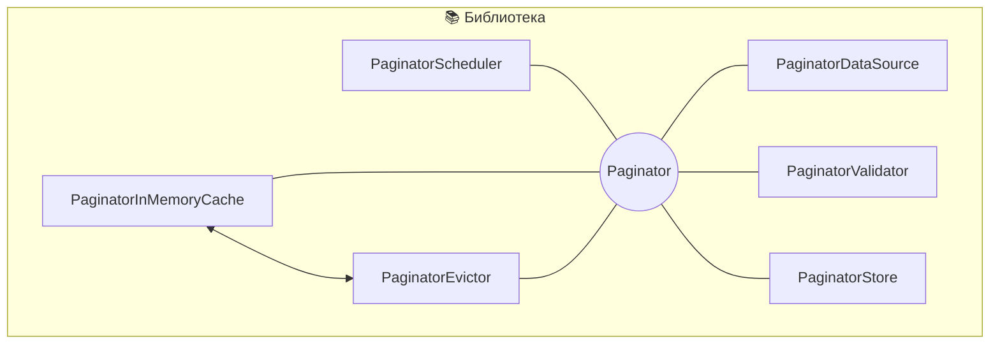
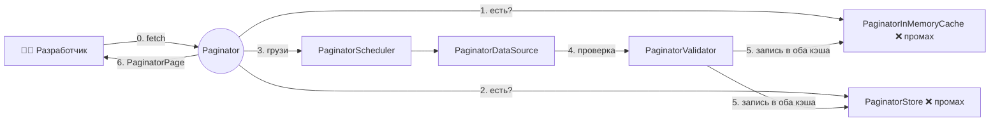

# Разбор: Библиотека пагинации 📚

> Спроектировать переиспользуемую **библиотеку пагинации** — как Jetpack Paging 3 от Google или Store5.
> Необычный кейс систем-дизайна: «пользователь» здесь не человек, а **другой разработчик**, а вместо
> экранов мы проектируем **публичный API**. Всё крутится вокруг постраничной подгрузки больших датасетов.

Проходим по тому же фреймворку [«ТАВДИ»](README.md#как-проходить-собес-фреймворк-из-5-шагов):
Требования → API → Высокоуровневая архитектура → Детали → Итоги.

Пагинация — это подгрузка больших списков **по страницам**, а не целиком: так приложение остаётся
отзывчивым даже на огромных объёмах контента. В [ленте новостей](02-news-feed.md#пагинация-cursor-based-курсорная)
мы делали пагинацию под конкретное приложение — здесь строим **универсальный инструмент**, который
подойдёт любому: чатам, каталогу товаров, ленте.

> ⚠️ **Это дизайн библиотеки, а не приложения — и это меняет всё.** Проектируя приложение, ты думаешь про
> UX конечного пользователя. Проектируя библиотеку, ты думаешь про **DX** (developer experience): API —
> это её «лицо». Фокус смещается с экранов на **интерфейсы, классы и модели данных**, с которыми
> разработчик будет жить каждый день. На собесе прямо проговори этот сдвиг — он показывает зрелость.

> 🧠 **Два кита, вокруг которых всё крутится:** **гибкость** (одна библиотека под любой тип данных, любой
> источник и любой async-фреймворк — через дженерики, DI и модульность) и **производительность** (двойной
> кэш память+диск, приоритеты запросов, потокобезопасность). Почти каждое решение ниже служит одному из
> них — держи эту пару в голове, и логика главы соберётся сама.

---

## Шаг 1. Требования — что именно строим

### Функциональные требования (что библиотека умеет)

- **Любые типы данных** и **несколько техник пагинации** (по смещению и по курсору).
- Пагинация из **локальных и удалённых** источников.
- Предоставляет **бизнес-логику**, но **не UI**.
- **Кэширование** в памяти и на диске, с возможностью конфигурировать.
- **Предзагрузка** (prefetch) указанных страниц.

### Нефункциональные требования (свойства системы)

- **Производительность** — эффективная пагинация с минимальной задержкой; **безопасность в многопоточной
  среде**.
- **Надёжность** — работает при сбоях сети, единообразно на разных устройствах и версиях ОС.
- **Юзабилити** — интуитивный API с полной документацией и примерами (это и есть «UX» для библиотеки).

### За рамками (out of scope)

- Поддержка пагинации на уровне **UI**.
- Поддержка **быстрой прокрутки**.

> 🧠 **Как запомнить требования.** Функции = **4 «любых» + кэш + prefetch**: любой тип данных, любая
> техника (offset/cursor), любой источник (локальный/удалённый), только логика (не UI) — плюс
> конфигурируемый кэш и предзагрузка. Свойства = **ПНЮ**: **П**роизводительность (+многопоточность),
> **Н**адёжность, **Ю**забилити (API как продукт).

> 💡 **Совет от профи.** Проектирование библиотеки — не про пользовательский опыт, а про **API**: удобство
> интеграции, помощь в решении задач, дизайн интерфейсов. Именно это оценивает интервьюер.

---

## Шаг 2. Дизайн API — как разработчик работает с библиотекой

Публичный API — это то, что видят и с чем взаимодействуют разработчики. Хороший API держится на трёх
китах: **чёткая документация**, **стабильность** (не ломается между версиями) и **интуитивный дизайн**,
следующий конвенциям платформы. Центральный элемент — интерфейс **`Paginator`**.

### Пагинатор на дженериках

Датасеты разные (сообщения, товары, посты), поэтому пагинатор — **дженерик** `Paginator<T>`:

| Преимущество дженериков | Что даёт |
|-------------------------|----------|
| **Гибкость** | один пагинатор под любой тип данных → меньше дублирующего кода |
| **Изоляция** | независимые экземпляры со своим кэшем и потоком пагинации, без конфликтов |
| **Оптимизация** | каждый экземпляр работает только со своими данными → низкие затраты памяти |
| **Надёжность** | типобезопасность проверяется **на этапе компиляции** |

```kotlin
interface Paginator<T> {
    fun fetch(key: String, pageSize: Int)
    fun fetchAround(key: String, pageSize: Int, depthLevel: Int, direction: PageFetchDirection)
    fun clear(key: String)
}
enum class PageFetchDirection { ALL, FORWARD, BACKWARD }
```

Три метода: **`fetch`** — выбрать конкретную страницу; **`fetchAround`** — предзагрузить соседние страницы
(на глубину `depthLevel` в направлении `direction`); **`clear`** — управление кэшем, удалить ранее
полученные страницы.

> 🧠 **Один `key` — обе техники пагинации.** Если `key` — целое число (`1`, `2`, …), это пагинация **по
> смещению** (offset). Если `key` — токен (`cursor123`), это **по курсору**. Один интерфейс покрывает обе
> стратегии — разработчик выбирает, а библиотеке всё равно. Методы **идемпотентны**: повтор с теми же
> параметрами даёт тот же результат.

### Распространение данных: нативные функции, без навязанных зависимостей

Как библиотека **возвращает** результат и **сообщает** об ошибках? Ключевое решение — использовать
**нативные функции** (листенеры), а не тащить конкретный async-фреймворк.

> ⚠️ **Библиотека с открытым кодом = осторожно с зависимостями.** Любая сторонняя зависимость станет
> обязательной для *всех*, кто интегрирует библиотеку. Навяжешь RxJava — заставишь всех тянуть RxJava.
> Поэтому базовый API строим на нативных механизмах, а поддержку популярных фреймворков вынесем в
> расширения (шаг 4).

Каждый метод возвращает объект **`PaginatorExecution`**, которым можно **отменить** операцию:

```kotlin
interface Paginator<T> {
    fun fetch(
        key: String, pageSize: Int,
        listener: PaginatorFetchListener<T>,
    ): PaginatorExecution

    fun fetchAround(
        key: String, pageSize: Int,
        depthLevel: Int, direction: PageFetchDirection,
        listener: PaginatorFetchAroundListener<T>,
    ): PaginatorExecution

    fun clear(key: String)
}
```

Внутри каждый экземпляр держит **потокобезопасный кэш** — обычно `Map`, связывающий ключи страниц со
значениями. Это ускоряет доступ к уже загруженным страницам.

### Модели данных

```kotlin
// Главный контейнер: контент + метаданные для навигации между страницами
public class PaginatorPage<T>(
    val content: List<T>,
    val key: String,
    val expirationTime: String?,  // опционально: когда страница «протухает» в кэше
    val nextKey: String?,
)
```

`PaginatorPage` хранит контент и ключи навигации (текущий, следующий, предыдущий). Опциональный
`expirationTime` позволяет интеллектуально управлять кэшем — понимать, какие страницы пора обновить.

> 📝 **Почему `class`, а не `data class` — вопрос бинарной совместимости (ABI).** В Kotlin `data class`
> автогенерирует `copy`, `componentN`, `equals`, `hashCode` — удобно в *приложении*, но изменение полей
> ломает бинарную совместимость. Для *публичного API библиотеки* это критично: обычный `class` даёт
> контроль над тем, что именно попадает в API, и не ломает старых потребителей. (В Swift та же логика —
> `struct` тоже value type, меняешь поля → рискуешь ABI.)

### Конфигурируемый экземпляр: `CallbackPaginator` + внедрение зависимостей

Разработчик собирает пагинатор под свои нужды через **DI**. `CallbackPaginator<T>` — реализация
`Paginator<T>`, принимающая четыре компонента:

```kotlin
class CallbackPaginator<T>(
    val dataSource: PaginatorDataSource<T>,          // 1. КАК грузить страницу (сеть/локально) — пишет разработчик
    val validator: PageValidator<T>,                 // 2. проверка целостности страницы
    val store: PaginatorStore<T>? = null,            // 3. (опц.) хранение на диске для офлайна
    val config: PaginatorConfig = DefaultPaginatorConfig(),  // 4. потоки, вытеснение кэша, настройки
) : Paginator<T> { /* ... */ }

class PaginatorConfig(
    val threadPool: ExecutorService,
    val maxParallelCalls: Int? = null,
    val inMemoryEvictionStrategy: PaginatorEvictionStrategy,
    val storeEvictionStrategy: PaginatorEvictionStrategy? = null,
)
```

- **`PaginatorDataSource<T>`** — сердце интеграции: разработчик реализует его, чтобы библиотека знала, как
  достать страницу из *его* источника.
- **`PageValidator<T>`** — проверяет корректность; если данные невалидны, страницу можно перезапросить.
- **`PaginatorStore<T>`** — опциональное дисковое хранилище (офлайн + меньше сетевых запросов).
- **`PaginatorConfig`** — параллелизм и **стратегии вытеснения кэша**.

> 🧠 **Конфиг на уровне экземпляра, а не статикой.** Соблазн сделать `Paginator.init(...)` глобально —
> плохой: каждый пагинатор должен настраиваться **независимо** (свой кэш, свои потоки). Конфиг на уровне
> экземпляра = гибкость.

> 🧠 **Стратегии вытеснения — три классики.** **LRU** (least recently used — выкидываем давно не
> использованное), **FIFO** (first in, first out — кто раньше пришёл), **LIFO** (last in, first out — кто
> позже). Кэш можно ограничить по числу страниц. Выбор стратегии — за разработчиком, под его ресурсы.

---

## Шаг 3. Высокоуровневая архитектура библиотеки

Ключевые приоритеты — **модульность**, масштабируемость и бесшовная интеграция с разными приложениями.
Функциональность разнесена по отдельным компонентам.



Два критически важных компонента:

- **`PaginatorScheduler`** — отвечает за параллельную обработку в потоках и обработку ответов; буферизует и
  распределяет запросы.
- **`PaginatorEvictor`** — эффективно освобождает память (вытеснение из кэша). Вынесен в отдельный
  компонент, чтобы вытеснение не грузило остальную систему.

> 💡 **Совет от профи.** Разделение на компоненты работает на две цели: (1) показывает интервьюеру, что ты
> владеешь **модульным проектированием**, и (2) убеждает, что тебе по плечу узкоспециальные задачи вроде
> кэширования и предзагрузки. Баланс: разработчику — гибкость (свои источники и хранилище), библиотеке —
> сложные задачи (планировщик, кэш).

---

## Шаг 4. Детальная проработка

Четыре ключевых аспекта: **двойной кэш**, **приоритеты запросов**, **модульный API** и **сбои + версии**.

### 4.1. Эффективное кэширование: двойная система память + диск

Библиотека объединяет два уровня кэша: **в памяти** (быстро) и **на диске** (надёжный резерв, офлайн).
Оба настраиваются через `PaginatorConfig`.

**Кэш в памяти** — компонент `PaginatorInMemoryCache` на основе `Map`, где значение явно моделирует
состояние страницы:

```kotlin
// Ключ String — уникальный id страницы (смещение, номер или курсор)
sealed class PaginatorPageResult<out T> {
    object Loading : PaginatorPageResult<Nothing>()          // идёт загрузка
    data class Success<T>(val page: PaginatorPage<T>) : PaginatorPageResult<T>()  // готова и проверена
    data class Error(val message: String) : PaginatorPageResult<Nothing>()        // ошибка загрузки
}
// ключа нет в Map → страница не в кэше
```

> 🧠 **Явное моделирование состояний.** `Loading / Success / Error` вместо «страница либо есть, либо null»
> даёт типобезопасность: компилятор заставит обработать все случаи, ошибки ловятся на этапе компиляции, а
> код проще отлаживать и масштабировать. (Тот же приём, что `MessageStatus` в [мессенджере](03-messenger.md).)

**Как работает двойной кэш** — поток данных при `fetch(key, limit)`, когда страницы нет в кэше:



1. **Проверка кэша в памяти** — есть страница? Возвращаем немедленно (малая задержка).
2. **Проверка диска** (опц.) — промах в памяти + настроен `PaginatorStore` → идём на диск; нашли →
   возвращаем и **поднимаем в память** для будущего.
3. **Выборка из источника** — нет нигде → `PaginatorScheduler` дёргает `PaginatorDataSource`.
4. **Валидация** — `PageValidator` проверяет корректность и актуальность.
5. **Обновление кэша** — новая страница пишется в **оба** кэша.
6. Страница возвращается вызвавшему.

> 🧠 **Почему двойной, а не один.** Память — скорость и малая задержка, диск — надёжный резерв и офлайн.
> Внимания требуют две вещи: ключ кэша не всегда = сетевому запросу (иногда нужна своя логика генерации
> ключей) и **потокобезопасность** (атомарные операции при параллельном доступе).

> 🏭 **Из индустрии.** Store5 (Kotlin Multiplatform) и Hyperoslo Cache (iOS) читают из памяти и диска,
> сохраняя копии на диск. Jetpack Paging (Google) — гибрид «сеть + БД»: `RemoteMediator` подгружает новые
> страницы в БД, когда локальные заканчиваются.

### 4.2. Приоритеты в обращениях к API

Приоритеты становятся критичны, когда: одновременные запросы конкурируют за пропускную способность;
фоновая предзагрузка накладывается на действия пользователя; устройство ограничено (батарея, слабая сеть).

Добавляем в API параметр приоритета:

```kotlin
interface Paginator<T> {
    fun fetch(
        key: String, pageSize: Int,
        listener: PaginatorFetchListener<T>,
        priority: FetchPriority = FetchPriority.MEDIUM,
    ): PaginatorExecution

    fun fetchAround(
        key: String, pageSize: Int,
        depthLevel: Int, direction: PageFetchDirection,
        listener: PaginatorFetchAroundListener<T>,
        keyPriority: FetchPriority = FetchPriority.MEDIUM,    // основная страница
        aroundPriority: FetchPriority = FetchPriority.LOW,   // соседние — ниже
    ): PaginatorExecution
}
enum class FetchPriority { HIGH, MEDIUM, LOW }
```

> 🧠 **Два уровня приоритета у `fetchAround` — неспроста.** Страница, которую юзер *ждёт сейчас*
> (`keyPriority`), важнее, чем страницы, что грузим *на всякий случай впрок* (`aroundPriority = LOW`). Так
> предзагрузка не перебивает то, что нужно прямо сейчас.

**Планирование задач — паттерн «очередь с приоритетом»** (сравнение в таблице):

| Паттерн | Плюсы | Минусы |
|---------|-------|--------|
| Отдельные очереди на уровень | простота, чёткое разделение, прямой контроль | падает производительность с ростом уровней, больше памяти |
| **Очередь с приоритетом** ✅ | эффективная и простая архитектура, низкие затраты памяти | сортировка чуть тормозит; низкий приоритет может долго ждать |
| Пулы потоков с уровнями | настоящий параллелизм на железе | сложное управление пулами, дороже по ресурсам |
| Циклическое взвешенное (weighted round-robin) | все приоритеты обработаны, справедливо | сложная настройка весов; высокий приоритет может ждать |

**Выбор — очередь с приоритетом:** задачи автоматически сортируются, срочные идут первыми, реализация
проста. Хороший баланс для мобильных систем с их ограничениями.

> 🏭 **Из индустрии.** Сетевая библиотека **Volley** от Google позволяет присваивать запросам уровни
> приоритета — срочные становятся первыми в очереди.

### 4.3. Модульный API — не навязывать async-фреймворк

Платформы используют разные подходы к асинхронности: Android — Kotlin Coroutines/Flow, RxJava, LiveData;
iOS — колбэки, Combine, async/await, RxSwift, GCD. Если зашить один в библиотеку, все потребители будут
обязаны его тянуть.

**Решение — модульный дизайн:** лёгкое ядро без async-зависимостей + расширения под популярные фреймворки:

- **`paginator-core`** — базовая функциональность, никаких внешних async-зависимостей.
- **`paginator-coroutines`**, **`paginator-combine`**, **`paginator-rx`** — оптимизированная поддержка
  конкретных решений; подключаешь только нужное.

Преимущества: **макс. гибкость** (берёшь только своё), **облегчённое ядро** (переносимее), **нативная
интеграция** (каждое расширение следует конвенциям своего фреймворка).

```kotlin
// Kotlin с корутинами и потоками (расширение paginator-coroutines)
interface Paginator<T> {
    suspend fun fetch(key: String, pageSize: Int): PaginatorPage<T>
    fun fetchAround(
        key: String, pageSize: Int,
        depthLevel: Int, direction: PageFetchDirection,
    ): Flow<PaginatorPage<T>>
    suspend fun clear(key: String)
}
```

> 📱 **Дистрибуция различается.** Android (Gradle) умеет собирать **несколько артефактов из одной кодовой
> базы** — каждая async-реализация отдельным артефактом. iOS традиционно — единый фреймворк, но модульность
> достижима: условная компиляция, отдельные файлы-расширения, продукты/цели в **Swift Package Manager**.

**Отдельный артефакт для тестирования.** Поставляем готовые **тест-дублёры** (моки `PaginatorDataSource`,
`PaginatorStore`, `PageValidator`), хелперы для генерации страниц и имитации задержки/сети, симуляцию
ошибок. Разработчикам не надо писать свои моки, покрытие лучше, а мы демонстрируем best practices.

> 🏭 **Из индустрии.** Jetpack Paging 3 отдаёт `PagingData` как поток, совместимый с LiveData, RxJava
> Flowable и Kotlin Flow. Библиотека Moya (iOS) спроектирована под тестируемость — свойство `sampleData` у
> эндпоинтов позволяет гонять юнит-тесты без реальной сети.

### 4.4. Обработка сбоев и управление версиями

**Потенциальные сбои** и как библиотека их держит:

| Сбой | Устранение |
|------|-----------|
| **Сеть** (тайм-ауты, обрывы, ошибки сервера) | `PaginatorDataSource` — повторы с **экспоненциальной задержкой**; если не помогло — кэш или сообщение об ошибке |
| **Ошибки БД** (кривой запрос, повреждение) | надёжная обработка + резервный вариант (например, догрузить из сети) |
| **Несоответствия в кэше** (устаревшие записи) | `PageValidator` проверяет актуальность и контрольные суммы; несвежее — перезапрос; лимит размера через `PaginatorConfig` |
| **Конкурентность** (гонки при параллельном доступе) | потокобезопасные структуры данных + синхронизация в `PaginatorStore` |
| **Неверные ключи страниц** (просроченный/битый курсор) | валидация ключей до обработки; отклонить или вернуться к известной стартовой точке |

**Управление версиями — семантическое версионирование (SemVer)** `MAJOR.MINOR.PATCH`:

| Часть | Когда растёт |
|-------|--------------|
| **MAJOR** | ломающие изменения, требующие правок кода (сменили интерфейс `Paginator`) |
| **MINOR** | новая функциональность без поломки (новое поле в `PaginatorConfig`) |
| **PATCH** | багфиксы и мелкие правки |

> 📱 **Почему SemVer важен для библиотеки.** iOS SPM опирается на семантическое версионирование при
> разрешении зависимостей; Gradle/Maven на Android тоже. Без SemVer автоматическое разрешение конфликтов
> версий ломается.

> 🏭 **Из индустрии: CalVer.** Иногда применяют **календарное версионирование**. Jetpack Compose сочетает
> оба: отдельные библиотеки (`compose-ui`, `compose-material`) — по SemVer, а артефакт **BOM** (Bill of
> Materials) — по CalVer `ГГГГ.ММ.PATCH` (например, `2025.02.00`). BOM упрощает зависимости: одна версия
> BOM = набор совместимых версий библиотек.

---

## Шаг 5. Итоги

Мы спроектировали библиотеку пагинации: работает с любым типом данных, поддерживает пагинацию по смещению
и по курсору, тянет данные из локальных и удалённых источников. Определили публичный API и надёжную,
масштабируемую, расширяемую архитектуру: кэширование, приоритеты, обработку сбоев, тестирование,
версионирование.

**Ключевые решения, которые стоит помнить:**

- **Дизайн библиотеки ≠ приложения** — «пользователь» это разработчик, «UX» это **API/DX**.
- **`Paginator<T>` на дженериках** — один интерфейс под любой тип данных; `key` покрывает offset и cursor.
- **Нативные функции, не навязанные зависимости** — иначе они станут обязательными для всех потребителей.
- **`class`, а не `data class`** в публичном API — ради бинарной совместимости (ABI).
- **DI через `CallbackPaginator`** — свой `PaginatorDataSource`, валидатор, стор, конфиг.
- **Двойной кэш** память + диск, состояния через `PaginatorPageResult` (`Loading/Success/Error`).
- **Очередь с приоритетом** — срочное вперёд; у `fetchAround` два уровня (ключ выше соседей).
- **Модульность** — лёгкое `paginator-core` + расширения `paginator-coroutines/combine/rx` + тест-артефакт.
- **SemVer** (и CalVer для BOM) — предсказуемая совместимость.

**Темы для роста (назови в конце — покажешь широту):**

- **Пагинация на уровне UI** — интеграция со списками/коллекциями для плавной прокрутки.
- **Фоновые сервисы предзагрузки** — грузить страницы, пока приложение простаивает.
- **Поддержка быстрой прокрутки** — своя обработка ошибок загрузки при скролле, повтор с кэшем.
- **Частичная загрузка страниц** — грузить часть страницы, когда ресурсы ограничены.

---

## Вопросы для самопроверки ✅

Ответь, не подглядывая. Ответы — под спойлерами.

**1. Чем дизайн библиотеки принципиально отличается от дизайна приложения?**

<details><summary>Ответ</summary>

«Пользователь» библиотеки — это **другой разработчик**, а не конечный человек. Значит, вместо экранов и
UX мы проектируем **публичный API** (DX — developer experience): интерфейсы, классы, модели данных,
документацию. Хороший API держится на трёх вещах: чёткая документация, стабильность (не ломается между
версиями) и интуитивный дизайн по конвенциям платформы. На собесе важно проговорить этот сдвиг фокуса.
</details>

**2. Зачем `Paginator` сделан дженериком и как один `key` покрывает обе техники пагинации?**

<details><summary>Ответ</summary>

Дженерик `Paginator<T>` даёт гибкость (один пагинатор под любой тип данных → меньше кода), изоляцию
(независимые экземпляры со своим кэшем), оптимизацию памяти и типобезопасность на компиляции. А `key`
универсален: целое число (`1`, `2`…) → пагинация **по смещению** (offset); токен (`cursor123`) → **по
курсору**. Один интерфейс, а стратегию выбирает разработчик.
</details>

**3. Почему в публичном API моделей используют `class`, а не `data class`?**

<details><summary>Ответ</summary>

Из-за **бинарной совместимости (ABI)**. `data class` автогенерирует `copy`, `componentN`, `equals`,
`hashCode`, и изменение его полей ломает бинарную совместимость со старыми потребителями библиотеки.
Обычный `class` даёт контроль над тем, что попадает в публичный API, и не ломает тех, кто уже собрался с
предыдущей версией. В Swift та же логика для `struct` (value type).
</details>

**4. Почему базовый API не завязывают на конкретный async-фреймворк, и как решают проблему?**

<details><summary>Ответ</summary>

Библиотека с открытым кодом используется многими приложениями. Любая зависимость (например, RxJava)
станет **обязательной для всех** потребителей. Поэтому ядро строят на **нативных функциях** (листенеры +
`PaginatorExecution` для отмены). А поддержку фреймворков выносят в **модульные расширения**:
`paginator-core` без зависимостей + `paginator-coroutines`/`-combine`/`-rx`. Подключаешь только нужное.
</details>

**5. Как работает двойной кэш при промахе, и зачем он вообще двойной?**

<details><summary>Ответ</summary>

При `fetch`: (1) смотрим кэш **в памяти** → есть, возвращаем сразу; (2) промах + настроен `PaginatorStore`
→ смотрим **диск**, нашли — возвращаем и поднимаем в память; (3) нет нигде → `PaginatorScheduler` грузит
через `PaginatorDataSource`; (4) `PageValidator` проверяет; (5) пишем в **оба** кэша; (6) отдаём. Двойной,
потому что память даёт скорость/малую задержку, а диск — надёжный резерв и офлайн. Состояния страницы
явно моделируются: `Loading / Success / Error`.
</details>

**6. Какой паттерн выбрали для приоритетов и почему у `fetchAround` два уровня?**

<details><summary>Ответ</summary>

**Очередь с приоритетом** (priority queue): задачи автоматически сортируются, срочные идут первыми,
реализация простая, память экономная — лучший баланс для мобильных ограничений (против отдельных очередей,
пулов потоков и weighted round-robin). У `fetchAround` два уровня: `keyPriority` для страницы, которую
юзер **ждёт сейчас**, и `aroundPriority` (обычно `LOW`) для соседних, что грузим **впрок** — чтобы
предзагрузка не перебивала актуальное.
</details>

**7. Как библиотека переживает сетевые сбои, битый кэш и гонки?**

<details><summary>Ответ</summary>

**Сеть** → `PaginatorDataSource` делает повторы с экспоненциальной задержкой, иначе кэш/ошибка.
**Несоответствия кэша** → `PageValidator` проверяет актуальность и контрольные суммы, несвежее
перезапрашивается, размер лимитируется через `PaginatorConfig`. **Конкурентность** → потокобезопасные
структуры данных и синхронизация. **Неверные ключи** (просроченный курсор) → валидация до обработки,
отклонить или вернуться к известной стартовой точке.
</details>

**8. Какую схему версионирования выбрали и почему это важно именно для библиотеки?**

<details><summary>Ответ</summary>

**SemVer** `MAJOR.MINOR.PATCH`: MAJOR — ломающие изменения (сменили интерфейс `Paginator`), MINOR — новая
функциональность без поломки, PATCH — багфиксы. Для библиотеки это критично: менеджеры зависимостей (SPM
на iOS, Gradle/Maven на Android) опираются на семантические версии при разрешении конфликтов. Иногда
применяют **CalVer** (Jetpack Compose: BOM в формате `ГГГГ.ММ.PATCH`), где одна версия BOM = набор
совместимых версий библиотек.
</details>

---

## Что почитать (ссылки из книги)

- Библиотеки-хранилища: [Store5 (KMP)](https://github.com/MobileNativeFoundation/Store),
  [Hyperoslo Cache (iOS)](https://github.com/hyperoslo/Cache),
  [Jetpack Paging 3](https://developer.android.com/topic/libraries/architecture/paging/v3-network-db).
- Приоритеты: [паттерн «очередь с приоритетом»](https://learn.microsoft.com/en-us/azure/architecture/patterns/priority-queue),
  [оптимизация Android Volley](https://javanexus.com/blog/optimizing-android-volley).
- Тестируемость: [Moya (iOS)](https://github.com/Moya/Moya),
  [сетевые вызовы через Moya](https://medium.com/simform-engineering/handling-network-calls-in-swift-with-moya-c82908c93e5).
- Версионирование: [SemVer](https://semver.org/),
  [SPM + SemVer](https://docs.swift.org/package-manager/PackageDescription/PackageDescription.html),
  [Jetpack Compose](https://developer.android.com/compose).
- Прочее: [тест-дублёры](https://en.wikipedia.org/wiki/Test_double),
  [публичный API в Kotlin](https://jakewharton.com/public-api-challenges-in-kotlin/),
  [Stable ABI в Swift](https://github.com/swiftlang/swift/blob/main/docs/ABIStabilityManifesto.md).
</content>
